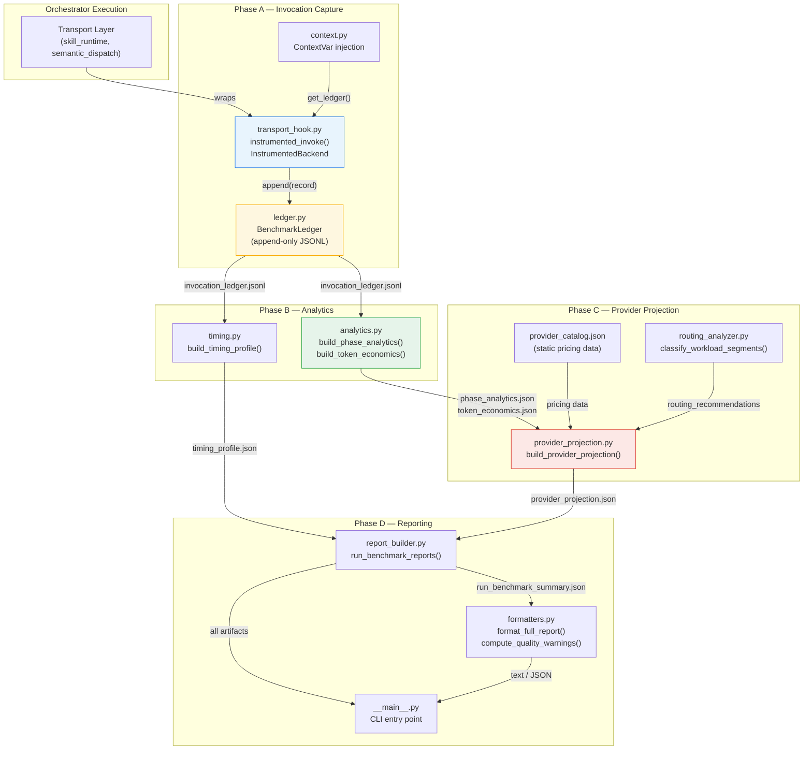

# Benchmark Engine Guide

## Proposal Orchestrator — Invocation Telemetry and Provider Projection

| Field | Value |
|---|---|
| Document type | Technical Architecture and Operations Guide |
| Classification | Internal — Audit, Handover, and Operations |
| Date | 2026-06-03 |
| System | Proposal Orchestrator Benchmark Engine (`runner/benchmark/`) |
| Schema version | 1.0.0 |

---

## Executive Summary

The benchmark engine is an instrumentation and analytics subsystem embedded within the Proposal Orchestrator. It captures per-invocation telemetry during orchestrator execution, aggregates the data into structured analytics artifacts, projects costs across alternative inference providers, and produces human-readable reports.

The engine exists to answer four operational questions that institutional stakeholders need answered before, during, and after production deployment:

1. **Migration validation.** When moving from one inference provider to another (e.g., Claude CLI to Amazon Bedrock), does the new backend produce the same number of successful invocations with comparable performance? The benchmark engine captures identical telemetry regardless of which backend is active, enabling direct comparison across providers.

2. **Provider comparison.** If the institution is evaluating alternative providers (self-hosted models, different cloud services), what would the same workload cost on each provider? The provider projection engine applies observed token consumption to a static provider catalog and produces per-model cost estimates, feasibility checks, and migration complexity classifications.

3. **Operational cost visibility.** How many tokens does a single orchestrator run consume? Which phases, skills, and semantic predicates are the most expensive? What is the largest single invocation? These questions are answered by the token economics artifact, which breaks down consumption by every dimension available in the telemetry.

4. **Performance transparency.** How long does each phase take? Which skills are slowest? What is the distribution of invocation latencies? Are there timeouts or failures? The timing profile artifact provides statistical summaries (mean, median, P95, P99) at the overall, per-skill, and per-predicate level.

The engine is designed to be invisible during normal operation. It has zero behavioural impact on the orchestrator and swallows all internal failures silently, so that a benchmark error can never cause a workflow failure.

---

## Design Goals

| Goal | Implementation |
|---|---|
| **Zero behavioural impact** | The transport hook wraps the existing transport layer. It forwards all parameters exactly and preserves the return value and exception semantics of the underlying transport. When benchmarking is disabled, the hook falls through with a single `None` check (~50ns). All benchmark failures are caught and logged at `DEBUG` level; no exception propagates to the orchestrator. |
| **Low overhead** | Telemetry capture consists of two `time.monotonic()` calls, two `len()` calls on strings, a character-to-token estimation, and a single `list.append()`. No serialisation occurs on the hot path. JSONL persistence is append-only with immediate `flush()`, not buffered. |
| **Provider neutrality** | The invocation record schema is identical regardless of whether the invocation used Claude CLI, Bedrock Converse, or an OpenAI-compatible backend. The `execution_mode` field distinguishes the transport path; the analytics pipeline treats all records uniformly. |
| **Reproducibility** | All analytics functions are pure: they take a list of record dicts as input and return a dict as output, with no side effects, no I/O, and no external dependencies beyond the Python standard library. Given the same `invocation_ledger.jsonl`, the same analytics artifacts are produced deterministically. |
| **Auditability** | Every invocation is recorded with a UUID, a UTC timestamp, and the complete set of operational metrics. The JSONL ledger is append-only and flush-after-write, so it survives process crashes. The ledger can be replayed through the analytics pipeline at any time to reproduce all derived artifacts. |

---

## Architecture Overview

The benchmark engine operates as a four-phase pipeline that progressively transforms raw invocation data into structured reports:



### Phase Summary

| Phase | Timing | Input | Output | Module(s) |
|---|---|---|---|---|
| **A — Capture** | During orchestrator execution (real-time) | Transport function calls | `invocation_ledger.jsonl`, `run_benchmark_summary.json` (initial) | `transport_hook.py`, `ledger.py`, `context.py`, `models.py`, `token_estimator.py` |
| **B — Analytics** | After execution completes | `invocation_ledger.jsonl` | `phase_analytics.json`, `token_economics.json`, `timing_profile.json` | `analytics.py`, `timing.py` |
| **C — Projection** | After Phase B completes | Phase B artifacts + `provider_catalog.json` | `provider_projection.json` | `provider_projection.py`, `routing_analyzer.py` |
| **D — Reporting** | On demand (CLI) | All artifacts | Human-readable text or merged JSON | `formatters.py`, `__main__.py` |

---

## Invocation Capture

### Module: `transport_hook.py`

The transport hook is the sole instrumentation point. It interposes between the orchestrator's call sites (skill runtime, semantic dispatch) and the actual transport layer, capturing telemetry for every LLM invocation without modifying the transport's behaviour.

Two instrumentation mechanisms exist for the two transport families:

| Mechanism | Transport Family | Integration Pattern |
|---|---|---|
| `instrumented_invoke()` | Claude CLI (`invoke_claude_text()`) | Call sites alias the function: `from runner.benchmark.transport_hook import instrumented_invoke as invoke_claude_text` |
| `InstrumentedBackend` | Bedrock Converse, OpenAI-compatible | Call sites wrap the backend: `backend = InstrumentedBackend(raw_backend, ...)` |

### Activation

Benchmarking is controlled by a `contextvars.ContextVar` (`context.py`). The DAG scheduler sets the active ledger at run start and clears it at run end. When `get_ledger()` returns `None`, both `instrumented_invoke()` and `InstrumentedBackend.__call__()` fall through directly to the underlying transport with no telemetry overhead — a single `None` check.

### What Is Captured

For every invocation, regardless of backend, the hook records a `BenchmarkInvocationRecord` (`models.py`) with these fields:

| Category | Fields | Source |
|---|---|---|
| Identity | `invocation_id` (UUID), `run_id`, `node_id`, `skill_id`, `predicate_id` | Passed by the call site |
| Classification | `invocation_type` (`skill_tapm`, `skill_cli_prompt`, `semantic_predicate`), `execution_mode` (`tapm`, `cli-prompt`, `openai_compat_tapm`) | Determined by the call site and transport path |
| Model configuration | `model`, `timeout_seconds`, `tools_enabled` | Transport parameters |
| Input size | `system_prompt_chars`, `user_prompt_chars` | `len()` of prompt strings (character count) |
| Output size | `response_chars` | `len()` of response string |
| Status | `response_status` (`success`, `timeout`, `error`) | Exception classification |
| Timing | `wall_clock_start`, `wall_clock_end`, `wall_clock_seconds`, `timestamp_utc` | `time.monotonic()` and `datetime.now(UTC)` |
| Token estimates | `estimated_input_tokens`, `estimated_output_tokens` | Character-to-token ratio estimation (`token_estimator.py`) |
| Error context | `error_class`, `error_message` (truncated to 500 chars) | Exception type and message |

### What Is Intentionally Not Captured

**Prompt content is never captured.** The hook measures `len(system_prompt)` and `len(user_prompt)` but does not record, log, or persist the text of any prompt or response. This is a deliberate design choice aligned with the system's data protection architecture: the benchmark engine must not create a persistent copy of proposal IP.

**Response content is never captured.** Only `len(response_text)` is recorded.

**Error messages are truncated to 500 characters** to prevent prompt fragments from leaking through exception messages.

### Token Estimation

The `token_estimator.py` module converts character counts to approximate token counts using model-specific character-to-token ratios:

| Model Family | Ratio (chars/token) |
|---|---|
| Claude (Sonnet 4.6, Opus 4.6, Haiku 4.5) | 3.5 |
| GPT-4o / GPT-4o-mini | 3.8 |
| LLaMA 3.1 (70B, 405B) | 3.6 |
| DeepSeek V3 | 3.4 |
| Default fallback | 3.5 |

These estimates are approximate (within 15-25% of actual tokeniser output) and are sufficient for cost comparison and trend analysis. They are explicitly not billing-grade. Every artifact that contains token estimates includes a warning to this effect.

When the backend provides actual token counts (via the `last_usage` property, available on Bedrock Converse and OpenAI-compatible backends), the hook uses the actual values instead of estimates.

### Failure Isolation

All telemetry operations are wrapped in `try/except` blocks that log at `DEBUG` level and never propagate exceptions. If the benchmark engine fails internally — malformed record, file I/O error, ledger corruption — the orchestrator's execution continues unaffected. This is a strict design requirement: the benchmark engine is an observer, not a participant.

---

## Invocation Ledger

### Artifact: `invocation_ledger.jsonl`

The ledger is an append-only JSONL file where each line is a JSON object representing one `BenchmarkInvocationRecord`. It is the single source of truth from which all downstream analytics are derived.

### Properties

| Property | Implementation |
|---|---|
| **Thread safety** | A `threading.Lock` serialises all `append()` calls. |
| **Durability** | Each record is written as a single JSONL line and immediately flushed (`file.flush()`). If the process crashes mid-run, all previously flushed records are preserved. |
| **Dual storage** | Records are accumulated in an in-memory list (for the Phase A summary) and simultaneously written to disk (for Phase B analytics). |
| **Malformed line tolerance** | The Phase B reader (`report_builder._read_ledger()`) skips malformed JSONL lines with a debug log, rather than failing the entire analytics pipeline. |

### Record Structure (Example)

```json
{
  "invocation_id": "86756fc21eaa4442b2ac7de56a04b036",
  "run_id": "smoke-phase1-001",
  "node_id": null,
  "skill_id": "call-requirements-extraction",
  "predicate_id": null,
  "invocation_type": "skill_tapm",
  "execution_mode": "openai_compat_tapm",
  "model": "us.anthropic.claude-sonnet-4-6",
  "timeout_seconds": 1200,
  "tools_enabled": ["Read", "Glob"],
  "system_prompt_chars": 1155,
  "user_prompt_chars": 35660,
  "response_chars": 91,
  "response_status": "success",
  "wall_clock_seconds": 3.4179,
  "timestamp_utc": "2026-06-02T22:18:10.732063+00:00",
  "estimated_input_tokens": 10368,
  "estimated_output_tokens": 175,
  "error_class": null,
  "error_message": null
}
```

### Audit Value

The ledger provides a verifiable, per-invocation record of every LLM call made during an orchestrator run. An auditor can determine:

- How many invocations occurred.
- Which skills and semantic predicates were invoked.
- Which model was used.
- Whether any invocations failed or timed out.
- The approximate token consumption per invocation.
- The wall-clock timing of each invocation.

The ledger does not record prompt content, so it can be shared with reviewers without exposing institutional IP.

### Replay Value

Because the analytics pipeline is pure (no side effects, no I/O beyond reading the ledger), the same `invocation_ledger.jsonl` can be replayed through Phase B and Phase C at any time to regenerate all derived artifacts. This enables re-analysis after updating the provider catalog or correcting analytics logic.

---

## Analytics Pipeline

### Module: `analytics.py`

The analytics module transforms the flat list of invocation records into two structured artifacts: phase analytics and token economics. All functions are pure — they take a list of record dicts and return a dict, with no side effects.

### Generated Output: `phase_analytics.json`

**Purpose:** Aggregates invocation counts, token estimates, timing, and failure rates by workflow phase and by workflow node.

**Structure:**

| Field | Description |
|---|---|
| `phases_observed` | List of phase numbers seen in the run (e.g., `[1]` for a Phase 1 smoke test). |
| `nodes_observed` | List of node IDs that generated invocations. |
| `per_phase` | Per-phase aggregation: invocations, tokens, wall-clock, TAPM count, CLI count, semantic predicate count, failures, timeouts. |
| `per_node` | Per-node aggregation with the same structure. |

**Phase inference:** When a record's `node_id` is null (as occurs with some transport backends that do not propagate node context), the analytics engine infers the node from the run summary or Phase A summary using a multi-step resolution chain. If a single unambiguous node can be determined, it is assigned. If multiple nodes are possible, no guess is made.

### Generated Output: `token_economics.json`

**Purpose:** Provides a comprehensive breakdown of estimated token consumption across every available dimension.

**Structure:**

| Field | Description |
|---|---|
| `total_estimated_input_tokens` | Sum of all estimated input tokens across the run. |
| `total_estimated_output_tokens` | Sum of all estimated output tokens. |
| `tokens_by_invocation_type` | Breakdown by `skill_tapm`, `skill_cli_prompt`, `semantic_predicate`. |
| `tokens_by_skill_id` | Per-skill token consumption. Identifies the most token-intensive skills. |
| `tokens_by_semantic_predicate_id` | Per-predicate token consumption. |
| `tapm_vs_cli_prompt` | Side-by-side comparison of the two execution modes. |
| `phase_8_estimated_total_tokens` | Phase 8 (drafting) token total — expected to dominate full-DAG runs. |
| `phases_1_7_estimated_total_tokens` | Phases 1-7 token total. |
| `largest_invocation_by_estimated_total_tokens` | Identifies the single most expensive invocation (invocation ID, skill ID, token count). |
| `largest_invocation_by_prompt_chars` | Identifies the largest prompt by character count. |

**Example from production smoke test (`smoke-phase1-001`):**

| Skill | Input Tokens | Output Tokens | Total | Share |
|---|---|---|---|---|
| `evaluation-matrix-builder` | 218,510 | 2,390 | 220,900 | 50.4% |
| `instrument-schema-normalization` | 133,893 | 10,154 | 144,047 | 32.8% |
| `call-requirements-extraction` | 35,264 | 6,659 | 41,923 | 9.6% |
| `topic-scope-check` | 29,041 | 2,928 | 31,969 | 7.3% |

### Generated Output: `timing_profile.json`

**Module:** `timing.py`

**Purpose:** Statistical summary of invocation latencies, identifying performance outliers and timeout/failure rates.

**Structure:**

| Field | Description |
|---|---|
| `total_wall_clock_seconds` | Total run duration. |
| `sum_invocation_wall_clock_seconds` | Sum of all individual invocation durations. |
| `idle_non_model_seconds_estimate` | Difference between total run time and sum of invocation times — the time spent on orchestration overhead (scheduling, file I/O, gate evaluation). |
| `mean_invocation_seconds`, `median_invocation_seconds` | Central tendency measures. High divergence between mean and median indicates outlier invocations. |
| `p95_invocation_seconds`, `p99_invocation_seconds` | Tail latency measures. |
| `timeout_count`, `failed_invocation_count` | Reliability indicators. |
| `timing_by_skill_id` | Per-skill breakdown: count, total, mean, median, min, max. |
| `timing_by_semantic_predicate_id` | Per-predicate breakdown. |

**Example from production smoke test:**

| Metric | Value |
|---|---|
| Total wall-clock | 366.67s (6m 7s) |
| Sum invocation time | 365.15s |
| Idle / overhead | 1.52s |
| Mean invocation | 22.82s |
| Median invocation | 3.36s |
| P95 | 178.06s |
| Timeouts | 0 |
| Failures | 0 |

The large divergence between mean (22.8s) and median (3.4s) indicates that most invocations are short tool-coordination rounds, while a few are long generative invocations that dominate total time.

---

## Provider Projection Engine

### Module: `provider_projection.py`

**Purpose:** Given the observed token consumption from a completed run, project what the same workload would cost on alternative inference providers, assess feasibility (context window, tool support), classify migration complexity, and produce ranked recommendations.

The projection engine is entirely offline and deterministic. It does not make API calls to providers, does not fetch live pricing, and does not modify any orchestrator or transport behaviour.

### Inputs

| Input | Source |
|---|---|
| `token_economics.json` | Phase B — observed token totals, per-skill breakdown, largest invocation |
| `phase_analytics.json` | Phase B — invocation counts, TAPM vs. CLI counts |
| `provider_catalog.json` | Static configuration file — provider pricing, context windows, capabilities |

### Cost Estimation Methodology

For each provider/model combination in the catalog, the engine computes:

```
projected_input_cost  = total_estimated_input_tokens  / 1,000,000 * input_cost_per_mtok
projected_output_cost = total_estimated_output_tokens / 1,000,000 * output_cost_per_mtok
projected_total_cost  = projected_input_cost + projected_output_cost
```

Three billing models are supported:

| Billing Model | Cost Calculation |
|---|---|
| `per_token` | Input + output cost as above. |
| `subscription` | Monthly subscription cost from the catalog. Not per-run. |
| `infrastructure` | Token cost is zero. External GPU/power/maintenance cost is not estimated. |

### Feasibility Assessment

For each provider/model, the engine checks:

| Check | Criterion |
|---|---|
| **Context window** | Does the model's max context accommodate the largest single invocation observed? |
| **Tool support** | If the workload includes TAPM invocations, does the model support function calling? |
| **System prompt** | Does the model support system prompts? (All orchestrator invocations use system prompts.) |

A model is classified as `supports_all_modes = true` only if all three checks pass.

### Migration Complexity Classification

| Classification | Meaning |
|---|---|
| `drop_in` | OpenAI-compatible, tool support, sufficient context — can be used via the existing `openai_compatible` backend with no code changes. |
| `adapter_needed` | Not OpenAI-compatible but all capabilities present — requires a transport adapter (e.g., Bedrock Converse). |
| `significant_work` | Capabilities are present but integration is non-trivial. |
| `not_suitable` | Insufficient context window, missing tool support, or missing system prompt support. |

### Security Posture Assessment

Each provider in the catalog includes a `security_posture` section with three boolean flags:

- `private_networking_possible` — Can traffic be routed through a private network (e.g., PrivateLink)?
- `data_residency_possible` — Can the institution control which region processes data?
- `zero_data_retention_possible` — Does the provider offer a contractual zero-retention guarantee?

The projection includes these flags in each provider's assessment and surfaces the best private-network candidate in recommendations.

### Routing Analyzer

The routing analyzer (`routing_analyzer.py`) classifies the observed workload into segments and assigns advisory capability tiers:

| Segment | Tier | Rationale |
|---|---|---|
| Phase 1-7 skill work | `high` (>100K tokens) or `mid_or_high` | Structured extraction requires accuracy. |
| Phase 8 drafting work | `high` | Evaluator-oriented text generation — quality is critical. |
| Semantic predicate work | `mid_or_high` | Binary/structured output may tolerate mid-tier models. |
| TAPM tool-augmented work | `mid_or_high` | Requires tool use API support. |
| CLI prompt work | `mid` | Plain prompt-response — broadest provider compatibility. |

These recommendations are advisory only. The orchestrator does not implement runtime model routing.

### Generated Output: `provider_projection.json`

Contains the complete projection: observed workload summary, per-provider cost/feasibility assessments, recommendations (lowest cost, best capability, best OpenAI-compatible, best private-network), routing recommendations, and migration warnings.

---

## Reporting Layer

### Module: `report_builder.py`

The report builder orchestrates the Phase B and Phase C pipelines and writes all artifacts atomically (write to temp file, then `os.replace()`). Phase C is failure-isolated from Phase B: if the provider projection fails, Phase B artifacts are still produced.

### Module: `formatters.py`

The formatters module contains pure functions that transform the structured JSON artifacts into human-readable plain text. All formatters are deterministic, use no external packages, and produce output suitable for both terminal display and snapshot testing.

The module provides six section formatters and two composite formatters:

| Formatter | Section | Content |
|---|---|---|
| `format_summary_report()` | Summary | Run ID, stage, invocations, tokens, timing, phases, provider availability |
| `format_token_report()` | Tokens | Token totals, TAPM vs. CLI, per-skill table, largest invocation |
| `format_timing_report()` | Timing | Wall-clock, mean/median/P95/P99, timeouts, per-skill timing table |
| `format_provider_report()` | Providers | Provider table with cost, suitability, migration complexity |
| `format_routing_report()` | Routing | Workload segments with candidate tiers |
| `format_quality_report()` | Quality | Data quality warnings (missing artifacts, inconsistencies) |
| `format_full_report()` | All | Concatenation of all six sections |
| `format_json_report()` | All (JSON) | Merged JSON with all artifacts and quality warnings |

### Data Quality Validation

The `compute_quality_warnings()` function performs cross-artifact consistency checks:

- Missing artifacts.
- Empty `phases_observed` when invocations exist.
- Phase 8 tokens are zero but Phase 8 nodes are present.
- TAPM count mismatches between phase analytics and token economics.
- Failed or timed-out invocations.
- Stale or unexpected `benchmark_stage`.

These warnings do not repair data; they report it. Phase D is read-only and advisory.

### CLI Entry Point: `__main__.py`

```
python -m runner.benchmark --run-id <run_id>              # Full report
python -m runner.benchmark --run-id <run_id> --section summary
python -m runner.benchmark --run-id <run_id> --json       # Merged JSON
python -m runner.benchmark --list                         # Available runs
```

---

## Generated Artifact Reference

| Artifact | Purpose | Consumer | Example Use Case |
|---|---|---|---|
| `invocation_ledger.jsonl` | Raw per-invocation telemetry log | Analytics pipeline, auditors, maintainers | Replay analytics after updating token estimator ratios. Verify that all 16 invocations in a Phase 1 run completed successfully. |
| `phase_analytics.json` | Per-phase and per-node aggregation | Report formatters, project managers | Determine that Phase 1 consumed 438,839 estimated tokens across 16 invocations on node `n01_call_analysis`. |
| `token_economics.json` | Token consumption breakdown by every dimension | Provider projection, procurement, budgeting | Identify that `evaluation-matrix-builder` accounts for 50.4% of Phase 1 token consumption, informing optimisation targets. |
| `timing_profile.json` | Statistical timing summary | Operations, performance engineering | Detect that the median invocation is 3.4s but P95 is 178s, indicating a small number of long-running generative invocations. |
| `provider_projection.json` | Per-provider cost/feasibility projection | Procurement, migration planning, security review | Compare projected cost across Bedrock, Together AI, and self-hosted Ollama. Verify which providers support private networking. |
| `run_benchmark_summary.json` | Consolidated run summary with Phase A/B/C fields | All consumers, CLI summary display | Confirm run `smoke-phase1-001` completed in 366.7s with 0 failures and 438,839 estimated tokens. |

---

## Security and Privacy Considerations

### Metadata Only

The benchmark engine captures operational metadata: character counts, token estimates, timing, status codes, model identifiers, and skill/predicate identifiers. It never captures, stores, or logs the text content of prompts or responses. This alignment with the system's data protection architecture (DC-35, `ORCHESTRATOR_DIAGNOSTIC_LEVEL=metadata`) is by design, not by configuration.

### No Retention Requirement

The benchmark engine does not require or create any persistent store of proposal content. The `invocation_ledger.jsonl` file can be shared with auditors, procurement teams, or external reviewers without exposing institutional IP, because it contains only operational metadata.

### Error Message Truncation

Error messages in benchmark records are truncated to 500 characters. This prevents prompt content from leaking into telemetry through exception messages that may echo parts of the input.

### Operational Transparency

The benchmark engine makes the cost and performance characteristics of LLM usage visible to institutional stakeholders. This supports:

- **Budget accountability.** Token consumption is quantified per run, per phase, and per skill.
- **Procurement evidence.** Provider projections provide documented cost comparisons for procurement processes.
- **Audit support.** The invocation ledger provides a verifiable record of all LLM calls made during each run, complementing CloudTrail's API-level audit trail (which records that a Bedrock call occurred but not which skill initiated it).

---

## Operational Workflow

### 1. Execute the Orchestrator

Run the orchestrator normally. The benchmark engine activates automatically when the DAG scheduler creates a benchmark ledger for the run.

```bash
python3 -m runner --run-id my-run-001 --phase 1 --verbose --json
```

### 2. Invocation Data Is Captured Automatically

During execution, every LLM invocation is recorded in `invocation_ledger.jsonl` within the benchmark directory (`.claude/benchmark/<run_id>/`).

### 3. Analytics Are Generated Automatically

When the run completes, the report builder executes Phase B (analytics) and Phase C (provider projection) automatically. The following artifacts are written:

```
.claude/benchmark/my-run-001/
  invocation_ledger.jsonl      # Phase A (during execution)
  run_benchmark_summary.json   # Phase A (initial) + B + C (expanded)
  phase_analytics.json         # Phase B
  token_economics.json         # Phase B
  timing_profile.json          # Phase B
  provider_projection.json     # Phase C
```

### 4. Review Benchmark Reports

View reports using the CLI:

```bash
# Full human-readable report
python -m runner.benchmark --run-id my-run-001

# Specific section
python -m runner.benchmark --run-id my-run-001 --section tokens

# Merged JSON for programmatic consumption
python -m runner.benchmark --run-id my-run-001 --json

# List all available runs
python -m runner.benchmark --list
```

### 5. Copy to Persistent Storage (Optional)

For institutional records, benchmark artifacts can be copied to the `docs/benchmark_reports/` directory:

```bash
cp -r .claude/benchmark/my-run-001/ docs/benchmark_reports/my-run-001/
```

The production smoke test artifacts are stored at `docs/benchmark_reports/smoke-phase1-001/`.

---

## Value to Institutional Operations

### Budgeting

Token economics artifacts provide the data needed to forecast per-run costs. A Phase 1 smoke test consumed approximately 438,839 tokens. Extrapolating to a full 8-phase run with drafting (where Phase 8 is expected to dominate token consumption) provides an order-of-magnitude cost estimate for budget planning.

### Procurement

Provider projection artifacts produce documented, reproducible cost comparisons across providers. When evaluating a contract with a new provider, procurement staff can compare the projected cost of the observed workload against the current provider, with feasibility and migration complexity assessments included.

### Provider Evaluation

The feasibility checks (context window, tool support, system prompt support) eliminate providers that cannot handle the workload before cost comparison begins. The security posture assessment (private networking, data residency, zero retention) identifies providers that meet institutional security requirements.

### Capacity Planning

Timing profiles identify performance bottlenecks and capacity constraints. The idle/overhead estimate (1.52s out of 366.7s in the smoke test) indicates that the orchestrator spends almost all its time waiting for the inference provider, making provider latency the primary capacity constraint.

### Governance

The invocation ledger provides a verifiable, per-invocation record that complements CloudTrail's API-level audit trail. Governance reviewers can verify that only authorised skills and predicates were invoked, that no invocations failed silently, and that token consumption is within expected bounds.

### Migration Planning

The routing analyzer classifies workload segments by required capability tier, supporting the strategic migration plan (`docs/internal_llm_migration_plan.md`) which evaluates hybrid deployment models where structured extraction uses local models while semantic reasoning uses a cloud provider. The benchmark engine quantifies how many tokens fall into each segment, enabling informed decisions about which workloads to migrate.

---

## Conclusion

The benchmark engine transforms the opaque cost of LLM inference into structured, auditable, reproducible data. It does so without capturing proposal content, without affecting orchestrator behaviour, and without requiring operator intervention.

For day-to-day operations, it provides automatic cost and performance visibility. For institutional governance, it provides a per-invocation audit trail that complements CloudTrail. For procurement and migration planning, it provides documented provider comparisons with feasibility and security assessments.

The engine's four-phase pipeline — capture, analytics, projection, reporting — produces six structured artifacts from a single orchestrator run. These artifacts can be replayed, compared across runs, and shared with stakeholders without exposing institutional IP. They form part of the evidence base for informed decisions about provider selection, budget allocation, and long-term operational strategy.

---

*Document prepared for audit, handover, and institutional review. All examples reference the production smoke test `smoke-phase1-001` (2026-06-02, Phase 1, Bedrock Converse, 16 invocations, 0 failures). Implementation references cite modules in `runner/benchmark/`.*
