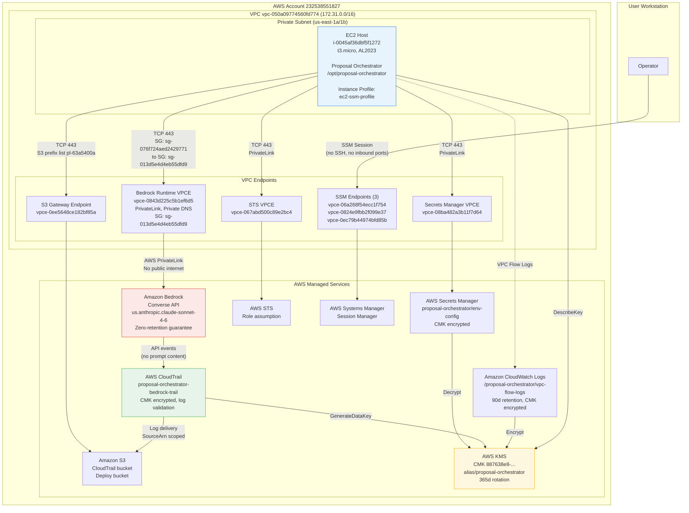

# Security Architecture Document

## Proposal Orchestrator — AWS Bedrock Deployment

| Field | Value |
|---|---|
| Document type | Security Architecture Description |
| Classification | Internal — Institutional Review |
| Date | 2026-06-03 |
| Infrastructure baseline | CG1-CG10 verified (38/41 VERIFIED_PASS, 2 N/A, 1 DEFERRED) |
| AWS account | `232538551827` |
| Region | `us-east-1` (US East, N. Virginia) |

---

## 1. System Overview

### 1.1 Application Purpose

The Proposal Orchestrator is an automated system for preparing Horizon Europe research and innovation proposals. It processes structured project inputs (call documents, consortium data, work package architectures) through an eight-phase workflow, invoking a large language model at each phase to produce evaluator-oriented proposal deliverables.

### 1.2 Execution Architecture

The system operates as a Python application deployed on an Amazon EC2 instance within a private VPC subnet. It consists of:

- **DAG Scheduler** — orchestrates execution of 13 workflow nodes across 8 canonical phases.
- **Agent Runtime** — loads agent specifications (22 agents) and sequences skill invocations.
- **Skill Runtime** — invokes the LLM through a transport adapter for each of 30 skills.
- **Transport Layer** — routes inference requests to Amazon Bedrock via the Converse API using IAM credentials and PrivateLink.
- **Gate Evaluator** — evaluates 11 gate conditions to enforce phase sequencing and constitutional compliance.

### 1.3 Deployed Components

| Component | Service / Resource | Resource ID |
|---|---|---|
| Execution host | EC2 (t3.micro, Amazon Linux 2023) | `i-0045af36dbf5f1272` |
| Instance profile | IAM Instance Profile | `proposal-orchestrator-ec2-ssm-profile` |
| Bedrock execution role | IAM Role | `proposal-orchestrator-bedrock-role` |
| LLM inference | Amazon Bedrock (Converse API) | Model: `us.anthropic.claude-sonnet-4-6` |
| Bedrock network path | VPC Interface Endpoint (PrivateLink) | `vpce-0843d225c5b1ef6d5` |
| Secret storage | AWS Secrets Manager | Secret: `proposal-orchestrator/env-config` |
| Secrets network path | VPC Interface Endpoint | `vpce-08ba482a3b11f7d64` |
| Token service path | VPC Interface Endpoint (STS) | `vpce-067abd500c89e2bc4` |
| Object storage path | VPC Gateway Endpoint (S3) | `vpce-0ee5648ce182bf85a` |
| Host management | SSM Interface Endpoints (3) | `vpce-06a268f54ecc1f754`, `vpce-0824e9fbb2f099e37`, `vpce-0ec79b44974bfd85b` |
| Encryption | AWS KMS (Customer-Managed Key) | `887638e8-358b-4664-9270-368aec0ea1f1` (alias: `proposal-orchestrator`) |
| Audit trail | AWS CloudTrail | Trail: `proposal-orchestrator-bedrock-trail` |
| Trail storage | S3 Bucket | `proposal-orchestrator-cloudtrail-232538551827` |
| Network audit | VPC Flow Logs (CloudWatch Logs) | `/proposal-orchestrator/vpc-flow-logs` |
| VPC | Amazon VPC | `vpc-050a09774560fd774` (172.31.0.0/16) |
| Private subnets | VPC Subnets | `subnet-023c6e3ea5451ea47` (us-east-1a), `subnet-01d969bb1421a3042` (us-east-1b) |
| Route table | VPC Route Table | `rtb-085481996de5e3ed9` (local + S3 prefix list; no IGW/NAT) |

---

## 2. Trust Boundaries

The architecture defines four trust boundaries. Traffic crossing each boundary is subject to specific security controls.

### TB-1: User Workstation to AWS Account

The operator accesses the EC2 host via AWS Systems Manager (SSM) Session Manager. No SSH is configured. No inbound security group rules exist. Authentication is via the operator's IAM identity, enforced by AWS SSM.

**Controls:** IAM authentication, SSM session logging, no inbound network ports.

### TB-2: AWS Account Boundary

The AWS account (`232538551827`) is the administrative boundary. All resources are deployed within this account. The account is not part of an AWS Organization (verified: evidence `REG-E04-organization-check.txt`). IAM policies, permission boundaries, and explicit deny statements constrain actions within the account.

**Controls:** IAM policies, permission boundaries, explicit deny statements (DC-09 through DC-15).

### TB-3: Private VPC Boundary

The EC2 host resides in private subnets with no internet gateway route, no NAT gateway route, and security groups that restrict all egress to VPC endpoint security groups and the S3 prefix list. All AWS service access occurs through VPC endpoints. The host cannot reach the public internet.

**Controls:** Private subnet routing (DC-06), host security group egress restriction (DC-07), VPC endpoint security groups (DC-03), VPC flow logs (DC-08).

**Evidence:** Route table `rtb-085481996de5e3ed9` contains only `local` (172.31.0.0/16) and S3 prefix list (`pl-63a5400a`). No `0.0.0.0/0` route exists. Verified in `control_group_1_logs.txt` lines 685-692.

### TB-4: Bedrock Managed Service Boundary

Traffic from the VPC to Amazon Bedrock traverses AWS PrivateLink. The Bedrock service processes inference requests and returns responses. AWS Bedrock provides a contractual zero-retention guarantee: input prompts and output completions are not stored after the API response is returned, and are not used for model training (AWS Bedrock Service Terms, Section 50.3).

**Controls:** PrivateLink endpoint with private DNS (DC-01, DC-02), endpoint policy scoped to Bedrock role and Claude models (DC-04), VPC endpoint security group (DC-03).

---

## 3. Data Flows

### DF-1: Proposal Input Ingestion

Proposal input documents (call data, consortium data, architecture inputs) are present on the EC2 host filesystem within the `docs/` directory tree. They are transferred to the host via S3 gateway endpoint during deployment. No data is received from the public internet at runtime.

**Path:** S3 bucket -> S3 gateway endpoint (`vpce-0ee5648ce182bf85a`) -> EC2 host filesystem (`/opt/proposal-orchestrator/docs/`)

### DF-2: Orchestrator Execution

The DAG Scheduler reads input artifacts from the local filesystem, sequences agent and skill invocations, and writes phase outputs and orchestration state to `docs/tier4_orchestration_state/`.

**Path:** Local filesystem (Tier 1-3 inputs) -> Python runtime -> Local filesystem (Tier 4 outputs)

### DF-3: Bedrock Inference

Each skill invocation sends a structured prompt (containing proposal data) to Amazon Bedrock via the Converse API. The request traverses the VPC PrivateLink endpoint. Bedrock returns the model response over the same private path.

**Path:** EC2 host -> boto3 client -> VPC Interface Endpoint (`vpce-0843d225c5b1ef6d5`) -> AWS PrivateLink -> Bedrock Runtime Service -> response via same path

**Security properties:**
- Traffic does not traverse the public internet (verified: private DNS resolves to VPC-internal IPs 172.31.27.207, 172.31.80.15; evidence `EV-PL-005` lines 417-428).
- Endpoint policy restricts to `proposal-orchestrator-bedrock-role` and `anthropic.claude-*` models only (evidence `EV-VPC-004-bedrock-endpoint-policy.json`).
- IAM policy enforces region restriction to `us-east-1` and `eu-west-1` (evidence `EV-IAM-003-policy-proposal-orchestrator-bedrock-invoke.json`).
- Bedrock zero-retention guarantee applies: no prompt or response data is stored by the service.

### DF-4: Secrets Retrieval

The application retrieves production environment configuration from AWS Secrets Manager at startup.

**Path:** EC2 host -> boto3 client -> Secrets Manager VPC Interface Endpoint (`vpce-08ba482a3b11f7d64`) -> Secrets Manager Service

**Security properties:**
- Secret is encrypted with the customer-managed KMS key (evidence `SM-E03-kms-key-association.txt`).
- Resource policy restricts access to the Bedrock role and the EC2 SSM role (evidence `SM-E04-resource-policy.json`).

### DF-5: Audit Logging

All Bedrock API invocations are recorded by AWS CloudTrail. Events include caller identity, timestamp, source IP, VPC endpoint ID, model ID, and TLS version. Prompt and response content is not logged (Bedrock invocation logging is disabled; evidence `CG7_logs.txt`).

**Path:** Bedrock API call -> CloudTrail -> S3 bucket (`proposal-orchestrator-cloudtrail-232538551827`)

**Security properties:**
- Trail is encrypted with the customer-managed KMS key (evidence `CT-E04-kms-encryption.txt`).
- Log file validation is enabled for integrity verification (evidence `CT-E03-log-file-validation.txt`).
- S3 bucket enforces encrypted uploads and denies insecure transport (evidence `CT-E07-s3-bucket-policy.json`).
- Lifecycle policy: Glacier IR archival at 90 days, deletion at 365 days (evidence `CT-E08-s3-lifecycle.json`).

### DF-6: Network Audit

VPC Flow Logs capture all network traffic on both deployment subnets and deliver records to CloudWatch Logs.

**Path:** VPC subnet ENIs -> Flow Logs service -> CloudWatch Logs (`/proposal-orchestrator/vpc-flow-logs`)

**Security properties:**
- Log group encrypted with the customer-managed KMS key.
- Retention period: 90 days.
- Evidence: `CG_8_logs.txt` lines 79-90.

### DF-7: Deliverable Generation

Proposal deliverables are written to the local filesystem under `docs/tier5_deliverables/`. They remain on the EC2 host until explicitly transferred by the operator.

**Path:** Python runtime -> Local filesystem (`/opt/proposal-orchestrator/docs/tier5_deliverables/`)

---

## 4. Security Controls Mapping

### 4.1 Network Controls

| Control | Implementation | DC Reference | Evidence |
|---|---|---|---|
| Private network transit for Bedrock | VPC Interface Endpoint with PrivateLink and private DNS | DC-01, DC-02 | `EV-PL-001-vpc-endpoints.json`, `EV-PL-005` |
| Endpoint access restriction | Endpoint security group: TCP 443 inbound from host SG only | DC-03 | `EV-PL-003-vpce-security-group.json` |
| Endpoint policy scoping | Policy restricts to Bedrock role and Claude model ARNs | DC-04 | `EV-VPC-004-bedrock-endpoint-policy.json` |
| Supporting service endpoints | SecretsManager, STS, S3 endpoints provisioned | DC-05 | `EV-PL-001-all-endpoints.json` |
| No internet route | Route table has no IGW or NAT route | DC-06 | `EV-PL-006-route-table.json` |
| Host egress restriction | Host SG allows TCP 443 to VPCE SG and S3 prefix list only | DC-07 | `EV-DEP-002-host-sg.json` |
| Network traffic logging | VPC Flow Logs on both subnets | DC-08 | `EV-DEP-003-flow-logs-subnet-a.json` |
| Internet egress blocked | No IGW/NAT route + SG egress restriction | DC-32 | Cross-ref DC-06, DC-07 |

### 4.2 Identity and Access Controls

| Control | Implementation | DC Reference | Evidence |
|---|---|---|---|
| Dedicated Bedrock role | `proposal-orchestrator-bedrock-role` with EC2 trust | DC-09 | `EV-IAM-001-role-config.json` |
| Scoped invoke permissions | InvokeModel + Stream on `anthropic.claude-*` with region condition | DC-10 | `EV-IAM-003-policy-bedrock-invoke.json` |
| Explicit deny statements | Deny admin actions, non-Bedrock services, non-Claude models | DC-11 | `EV-IAM-003-policy-explicit-deny.json` |
| Permission boundary | Maximum scope: Bedrock invoke + SecretsManager get + KMS decrypt + STS identity | DC-12 | `EV-IAM-004-boundary-metadata.json` |
| Instance profile auth | EC2 instance profile, no long-term access keys | DC-14, DC-15 | `IAM_Least_Privilege_logs.txt` |
| Region enforcement | IAM condition `aws:RequestedRegion` = `[eu-west-1, us-east-1]` | DC-16 | `EV-IAM-003-policy-bedrock-invoke.json` |

### 4.3 Encryption Controls

| Control | Implementation | DC Reference | Evidence |
|---|---|---|---|
| Customer-managed KMS key | Symmetric CMK with annual rotation | DC-18 | `EV-KMS-001-key-description.json`, `EV-KMS-002-rotation-status.json` |
| Key policy scoping | Key usage limited to Bedrock role, CloudTrail, CloudWatch Logs | DC-19 | `EV-KMS-003-key-policy.json` |
| Secret encryption | Secrets Manager secret encrypted with CMK | DC-20 | `SM-E03-kms-key-association.txt` |
| Trail encryption | CloudTrail logs encrypted with CMK | DC-23 | `CT-E04-kms-encryption.txt` |
| Flow log encryption | CloudWatch Logs group encrypted with CMK | DC-30 | `CG_8_logs.txt` |

### 4.4 Audit and Monitoring Controls

| Control | Implementation | DC Reference | Evidence |
|---|---|---|---|
| CloudTrail API logging | Trail active, captures Bedrock Converse events | DC-23, DC-26 | `CT-E01-trail-configuration.json`, `CT-E06-bedrock-converse-events.json` |
| Log integrity | Log file validation enabled | DC-24 | `CT-E03-log-file-validation.txt` |
| Trail storage security | S3 bucket: versioned, lifecycle, deny insecure transport | DC-25, DC-27 | `CT-E07-s3-bucket-policy.json`, `CT-E08-s3-lifecycle.json` |
| No prompt logging | Bedrock invocation logging disabled | DC-28, DC-29 | `CG7_logs.txt` |
| No Claude CLI | `claude` binary not present on host | DC-31 | `CG_8_logs.txt` lines 92-114 |

### 4.5 Application Controls

| Control | Implementation | DC Reference | Evidence |
|---|---|---|---|
| Production mode enforcement | `ORCHESTRATOR_PRODUCTION_MODE=true` rejects non-Bedrock backends | DC-33 | `CG9_logs.txt` |
| Transport preset | `BEDROCK_CONVERSE_US` selects IAM-authenticated Bedrock | DC-34 | `CG9_logs.txt` |
| Diagnostic sanitisation | `DIAGNOSTIC_LEVEL=metadata` prevents prompt/response disk writes | DC-35 | `CG9_logs.txt` |
| Model availability | `us.anthropic.claude-sonnet-4-6` confirmed in us-east-1 | DC-36 | `CG9_logs.txt` |

---

## 5. Architecture Diagram

### Diagram Notes

- Solid lines represent active data flows during orchestrator execution.
- Dashed lines represent background monitoring flows (VPC Flow Logs).
- All traffic between the EC2 host and AWS services traverses VPC endpoints within the private network. No traffic traverses the public internet.
- The host security group (`sg-076f724aed2429771`) permits TCP 443 egress only to the VPC endpoint security group (`sg-013d5e4d4eb55dfd9`) and the S3 prefix list (`pl-63a5400a`).
- The route table (`rtb-085481996de5e3ed9`) contains no Internet Gateway or NAT Gateway route.

---

## 6. Verification Status

| Category | Controls | Verified | N/A | Deferred |
|---|---|---|---|---|
| Network / PrivateLink | 8 | 8 | 0 | 0 |
| IAM Least Privilege | 7 | 7 | 0 | 0 |
| Region Enforcement | 3 | 2 | 1 | 0 |
| KMS Encryption | 2 | 2 | 0 | 0 |
| Secrets Manager | 3 | 2 | 1 | 0 |
| CloudTrail | 5 | 5 | 0 | 0 |
| CloudWatch | 3 | 3 | 0 | 0 |
| Data Egress Prevention | 4 | 4 | 0 | 0 |
| Production Config | 5 | 4 | 0 | 1 |
| Compliance | 1 | 1 | 0 | 0 |
| **Total** | **41** | **38** | **2** | **1** |

**N/A controls:** DC-22 (API key rotation — IAM auth used, no API key exists), DC-40 (SCP — account not in AWS Organization).

**Deferred control:** DC-38 (full DAG run with production config — pending application deployment completion; all infrastructure controls verified).

---

*Document prepared for institutional security architecture review. All control references cite evidence artifacts collected during the CG1-CG10 hardening programme (2026-05-29 to 2026-06-01). Automated evidence regeneration is available via `collect_evidence.ps1`.*
