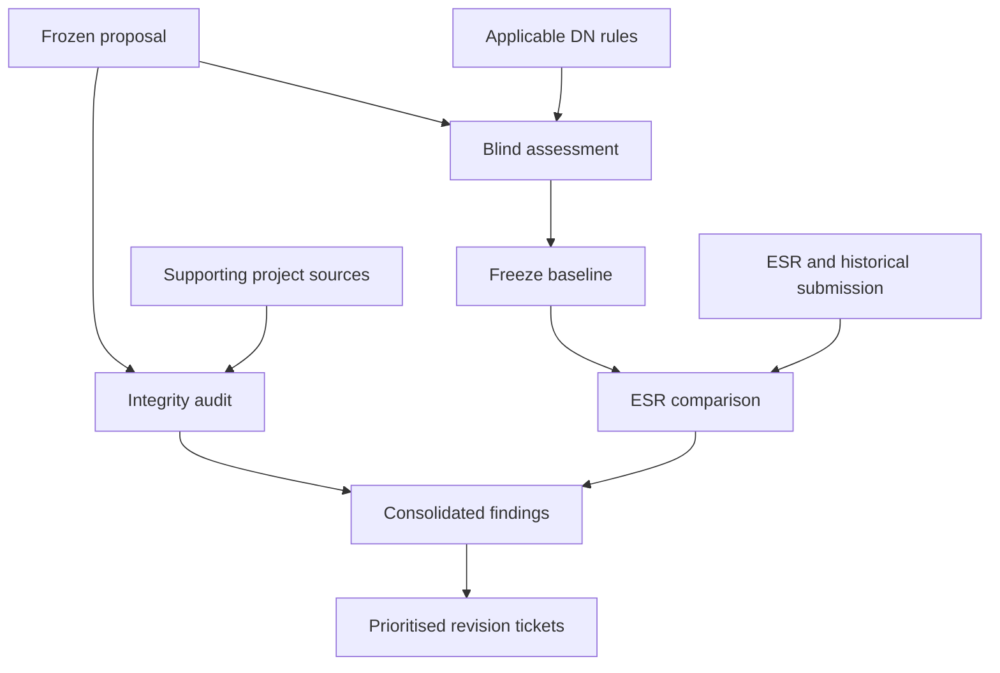

"https://github.com/JozsefKiss90/proposal_orchestrator/blob/dev_graph_demo/plans/dev_graph_demo_tickets.md https://github.com/JozsefKiss90/proposal_orchestrator/tree/dev_graph_demo/.scratch/dev-graph-milestone-1 https://github.com/JozsefKiss90/proposal_orchestrator/blob/dev_graph_demo/plans/reports/dev_graph_demo_report_2026-10-03.md https://github.com/JozsefKiss90/proposal_orchestrator/tree/dev_graph_demo/docs/tier4_orchestration_state/dev_graph  I have finished creating a demo of the development graph. The next step is to move on to the pre-evaluation/scoring (ESR available) for the real project. Based on the current state of the dev graph and the harnesses, please help me specify how I should proceed with the pre-evaluation/scoring. The project that I want to score and pre-evaluate is a fully written MSCA-DN Horizon Europe proposal."

**Your next step should be a dedicated milestone: “Imported MSCA-DN proposal — blind baseline, integrity audit, and ESR comparison.”** The existing architecture provides much of the foundation, but a trustworthy DN score needs several targeted additions.

For this completed proposal, use the **offline assessment path**. You do not need to run Phases 1–8 or redraft the proposal before evaluating it.

Based on the [demo report](https://github.com/JozsefKiss90/proposal_orchestrator/blob/dev_graph_demo/plans/reports/dev_graph_demo_report_2026-10-03.md) and the implementation, I recommend the following specification.

**1. Separate three assessment tasks**

| Task | Information it receives | Question it answers |
|---|---|---|
| **Blind pre-evaluation and scoring** | Frozen proposal and applicable evaluation/call documents | How would this submitted text perform against the DN criteria? |
| **Integrity audit** | Proposal, claim ledger, project records and supporting sources | Are material claims supported, consistent and accurately qualified? |
| **ESR comparison** | Frozen blind result, ESR and the proposal version evaluated by the ESR | Which historical weaknesses were independently detected, remain unresolved, or have been addressed? |

The distinction matters because **ESR availability should not change the blind assessor’s evidence**. Record the ESR as available, but keep its comments, scores and any target score outside the blind assessment context.

Your [intake implementation](https://github.com/JozsefKiss90/proposal_orchestrator/blob/dev_graph_demo/runner/dev_graph/intake.py) already supports this distinction through `blind_pre_evaluation` and `esr_informed_review`. However, the latter purpose is an intake declaration; the current blind command explicitly refuses it. A working ESR comparison workflow still needs to be added.

**2. Establish exactly what is being evaluated**

Create an isolated real-project workspace using the reviewed implementation. Preserve the demo as a reproducible example.

The intake should identify:

- The proposal’s call ID, call year and DN implementation mode.
- The exact candidate being assessed, with original-file hashes.
- The submission and proposal version to which the ESR belongs.
- Whether the current candidate is that submitted version or a later revision.
- The applicable application template, evaluation form and work programme versions.

This produces two possible evaluation designs:

| Current candidate | Correct interpretation |
|---|---|
| Exactly the proposal assessed by the ESR | Retrospective test: assess blindly, then compare predictions and findings with the ESR. |
| A revised proposal | Assess the revision blindly; use the ESR to examine whether historical weaknesses were addressed. Do not treat its old score as the current candidate’s ground truth. |

If the proposal was submitted under an earlier call, reproduce that assessment using its historical rules. Assessing readiness for a later call should be a separately labelled run under the later profile.

**3. Add a genuine MSCA-DN profile**

The branch currently ships **MSCA-PF and RIA profiles**. Its extracted evaluator registry also lacks a DN entry. Selecting the PF profile or renaming it would give the wrong evaluation.

Add these proposed artifacts:

| Proposed artifact | Purpose |
|---|---|
| `harness/profiles/msca_dn_default.json` | DN instrument, variant selection, section mapping and component pins |
| `harness/evaluator_scorecard_msca_dn.json` | Applicable official aspects, scoring scale, weights and source references |
| `harness/rubrics_msca_dn.json` | DN-specific assessment instructions and evidence anchors |
| DN entries in the relevant Tier 2A registries | Instrument and template coverage without overwriting PF/RIA entries |

The currently published MSCA evaluation form distinguishes the following DN aspects:

| Criterion | DN coverage |
|---|---|
| Excellence | Objectives; methodology; training programme; supervision |
| Impact | Structuring doctoral training and innovation capacity; careers and skills; dissemination/exploitation/communication; wider impacts |
| Implementation | Work plan, risks and effort; participants’ capacity, roles, hosting and complementary expertise |

It specifies criterion scores from **0–5 in one-decimal increments**, with **50%, 30%, 20%** weighting. Verify the applicable call’s rules before freezing the profile. [ec.europa.eu](https://ec.europa.eu/info/funding-tenders/opportunities/docs/2021-2027/horizon/temp-form/ef/ef_he-msca_en.pdf?utm_source=chatgpt.com)

The profile acceptance test should verify the official aspect texts, DN option selection, section anchors and component versions. Include a check that PF-only researcher experience and two-way knowledge-transfer aspects cannot enter a DN assessment.

**4. Import the completed proposal faithfully**

Your existing [`build_part_b_candidate.py`](https://github.com/JozsefKiss90/proposal_orchestrator/blob/dev_graph_demo/tools/build_part_b_candidate.py) converts **Phase 8 section artifacts** into a candidate. It is not an importer for an externally authored PDF or DOCX.

Specify a separate import adapter that:

- Preserves wording, headings, tables, captions and references.
- Maps sections and subsections to the DN profile’s anchors.
- Records page locations and offsets against versioned extracted text.
- Reports extraction losses, including unreadable figures or tables.
- Produces immutable candidate snapshots through the existing document importer.
- Keeps the original submitted documents alongside the extraction.

Include relevant Part A and Part B2 material in the assessment scope where required. A three-section candidate can satisfy the current structural completeness check while still omitting information needed for a credible evaluation.

**Do not require full Tier 3 reconstruction before the blind baseline.** Reconstruct project records for the integrity audit as needed. Importing a statement proves that the proposal contains it; it does not independently confirm the statement’s truth.

**5. Correct the scoring contract before trusting a total**

This is the most consequential implementation gap.

The current [blind assessment](https://github.com/JozsefKiss90/proposal_orchestrator/blob/dev_graph_demo/harness/blind_assessment.py) returns expectation-level **0–1 diagnostic grades**. Those are not official criterion scores.

Furthermore, the shared [rubric prompt](https://github.com/JozsefKiss90/proposal_orchestrator/blob/dev_graph_demo/harness/rubrics.py) asks whether an expectation is both addressed and grounded. The demo’s RIA rubrics specifically require confirmed ledger entries and source references. The report attributes weak results partly to source references disappearing during candidate conversion.

For the DN milestone, specify two distinct outputs:

| Output | Required behaviour |
|---|---|
| **Expectation diagnostics** | Identify strengths, weaknesses and decisive proposal passages for every applicable aspect. |
| **Criterion scoring** | Give one holistic 0–5 score per criterion, using the official descriptors and explaining the shortcomings that justify it. |

Do not calculate the criterion score simply by averaging diagnostic cells and multiplying by five. That would introduce an aggregation rule which the official evaluation form does not supply.

For criterion scores \(E\), \(I\) and \(Q\), the weighted total is:

\[
S=10E+6I+4Q
\]

The evaluator-facing projection should assess substantiation **visible in the submitted proposal**, including its citations and explanations. Missing internal import metadata should become an integrity or extraction finding, rather than automatically becoming a proposal-quality penalty.

Equally, preserve genuine weaknesses visible in the proposal. The official form requires assessment of the submitted application’s actual content, rather than its potential after improvements. [ec.europa.eu](https://ec.europa.eu/info/funding-tenders/opportunities/docs/2021-2027/horizon/temp-form/ef/ef_he-msca_en.pdf?utm_source=chatgpt.com)

**6. Make evidence completeness a preflight requirement**

The demo revealed two separate budget problems:

| Budget | What must be checked |
|---|---|
| Dev-graph package budget: `--package-budget` | The document package includes everything required under its view policy. |
| Per-expectation evidence budget: `--budget` | Relevant prose and claims were not excluded because they exceeded the assessor pack budget. |

Increasing one does not resolve the other.

Before paid assessment, produce a preflight report covering:

- Required sections and rubric anchors.
- Preservation of tables, references and relevant cross-section evidence.
- Package completeness and every budget exclusion.
- ESR, historical-score and repair-plan leakage checks.
- Candidate, profile and policy hashes.
- Estimated calls, tokens and transport limits.

A `scope: complete` report currently means the required section files exist. It does **not** establish that every relevant passage reached the assessor.

Also inspect evidence-selection quality: a passage excluded as “not relevant” by lexical selection may still matter to an evaluator. Particularly for DN, verify connections among individual doctoral projects, network training, supervision, secondments, recruitment and work-package delivery.

**7. Run and freeze the baseline, then examine the ESR**

Use a pinned assessor with no proposal-development or ESR context. Prefer a model independent of the drafting model. Retain the harness’s N≥3 sampling and provenance, while recognising that repeated samples from one model measure repeatability more than independent expert agreement.

Once the blind output is frozen, analyse the ESR through a separate task. Preserve each historical observation and map it to:

| Field | Required content |
|---|---|
| Historical finding | ESR text and its location |
| Criterion/aspect | Applicable DN evaluation aspect |
| Historical proposal evidence | Passage to which the observation relates |
| Current proposal evidence | Passage showing whether it remains relevant |
| Blind finding | Corresponding independently produced observation, if any |
| Resolution | Addressed, partially addressed, unresolved, or not assessable |
| Explanation | Evidence supporting the classification |

Compare criterion scores separately from qualitative findings. An ESR often provides criterion-level scores without assigning a numerical deduction to each criticism; do not invent those deductions.

Use this comparison to diagnose missed weaknesses, false positives and score differences. Preserve the original blind run if you subsequently revise prompts or rubrics. One proposal–ESR pair is a useful case study, not sufficient validation of scoring accuracy.

**8. Implement this as a bounded ticket sequence**

These are proposed tickets, rather than capabilities already present:

| Ticket | Work | Acceptance condition |
|---|---|---|
| **PE-01 — Freeze intake and sources** | Isolate the real project; bind candidate, submission, ESR and applicable rules. | Every input has an explicit version and role; demo records cannot enter the assessment. |
| **PE-02 — DN evaluation bundle** | Add DN profile, scorecard, rubrics and registry coverage. | Official aspects and anchors verified; PF/RIA profiles remain intact. |
| **PE-03 — External proposal import** | Convert the authored proposal into immutable assessment artifacts. | Wording and tables checked against originals; extraction losses and provenance recorded. |
| **PE-04 — Evaluator scoring contract** | Separate proposal-visible assessment from internal integrity metadata; add holistic criterion scoring. | Missing internal metadata cannot silently lower evaluator scores; totals follow the pinned scoring rules. |
| **PE-05 — Evidence preflight** | Check both budgets, evidence selection, completeness and leakage. | No unexplained omission of required evidence before assessment. |
| **PE-06 — Blind baseline** | Run diagnostics and criterion scoring; freeze reports and provenance. | Results bind to the exact candidate, profile and assessor; ESR context is absent. |
| **PE-07 — Integrity audit** | Apply grounding, ledger completeness and consistency checks. | Unsupported claims, missing sources and uncertain facts remain visible as separate findings. |
| **PE-08 — ESR comparison and handoff** | Implement the labelled comparison task and consolidate findings. | Every historical weakness has a traceable disposition; proposed revisions are prioritised separately. |

**You do not need to complete all of Milestone 2 first.** Address the relevant parts of **M4**—provenance preservation—and **M10**—evidence budgets—within this milestone. M12/M13 matter if you invoke Phase 1; avoid that route for this imported baseline. Fine-grained reuse, broader change vocabulary and multi-record revision contracts can wait until controlled revision begins.

The deliverable should be **a reproducible baseline score, a separate integrity report, and a traceable ESR comparison**. Keep the impact planner in shadow mode and the harness advisory boundary intact. The report’s outstanding test failures should remain documented; new assessment-path checks must pass before relying on this baseline.

"Due to the fact that evaluating and scoring the resubmitted proposal can only be done on a private network, I can currently only use the sanitised version of the previously submitted project (MSCA DN 2025) for the proposed development and implementation steps. Therefore, this is not the final version of the proposal, but only the sanitised version, which contains the key information from Part B. However, some minor prose has been lost and some content has been rephrased. The ESR is a verbatim extract with no project details. Does this introduce a risk to the evaluation and scoring strategy, and can these documents be used reliably to establish the required framework for the official resubmission?"

**Yes—these documents can reliably support development of the assessment framework. However, they cannot establish that its scores accurately reproduce the original evaluation or predict the final resubmission’s score.** Sanitisation does not invalidate the strategy; it changes what this development stage can demonstrate.

The appropriate goal now is **an implementation tested on a sanitised historical case**, followed by validation against the authoritative documents inside the private network.

**The proposal contains changes that matter to evaluation.**

In sanitized_proposal.pdf, I found:

- Editing dialogue on pages 41 and 45, including instructions about reproducing and sanitising sections.
- Repeated placeholder references such as `[Proposal-S...-211223728 | PDF]`, which do not identify the underlying supporting sources.
- Generalised descriptions of institutions, facilities and expertise.
- Reformatted tables and an 81-page layout. I did not find a dedicated milestone table or Gantt chart in this copy.

These observations do not establish what was missing from the original submission. They establish that this copy needs to be treated as a **derived document**, with its own limitations.

Even small prose changes can matter here: the ESR criticises insufficient methodological detail, clinical validation, training mechanisms, supervision monitoring, work-package dependencies and mitigation thresholds. Removing or strengthening a sentence about those subjects could change the apparent severity of a finding.

**The ESR remains useful as historical evidence.**

MSCA DN ESR.pdf supplies criterion scores of **4.20, 4.50 and 4.20**, and a total of **85.80%**. Those figures are internally consistent with the stated weights.

Accepting your declaration that the evaluation text is verbatim, it provides a valuable record of the evaluators’ reasoning. Its relationship to the sanitised proposal is nevertheless approximate: the evaluators assessed the original submitted wording and supporting material.

Consequently, **85.80% is a historical result, not an expected output that the harness must reproduce for the sanitised copy.**

| What you want to establish | Suitability of these documents |
|---|---|
| Importing, section mapping, graph construction and evidence packaging | Strong development inputs; omissions can also exercise failure handling. |
| Candidate hashes, immutable reports, provenance and ESR exclusion | Suitable for meaningful implementation tests. |
| DN criteria coverage and scoring arithmetic | Suitable, using the applicable official documents to define the profile. |
| Mapping ESR observations to proposal passages | Useful, with explicit labels for uncertain or unavailable correspondence. |
| Accurate reproduction of the original scores | Not reliably established from the sanitised copy. |
| Accuracy of grounding judgments | Requires the underlying evidence and human-labelled claim/source examples. |
| Final resubmission quality and score | Requires the final candidate inside the private network. |

**I would adjust the proposed milestone in five ways.**

**1. Record the sanitised copy’s provenance explicitly.**  
Its intake should distinguish:

- Historical submission: MSCA-DN 2025.
- Current assessment artifact: sanitised derivative.
- Transformation: identifiers generalised, some prose omitted or rephrased.
- Relationship to ESR: same underlying project, different assessment text.
- Authoritative original: available only inside the private network.

Hash the sanitised file and its extracted artifacts separately. Keep the private mapping to the original outside this workspace. Do not describe the sanitised candidate as the exact submitted version.

**2. Add a sanitisation and extraction register.**  
For each affected section or table, record whether it is preserved, generalised, rephrased, omitted, or of unknown fidelity. You can begin with the known issues above; the private-network review can complete the comparison against the original.

The register must distinguish three different findings:

| Finding | Interpretation |
|---|---|
| Weakness visible in the supplied text | A valid observation about the sanitised candidate. |
| Evidence unavailable because of sanitisation | An assessment limitation requiring verification against the original. |
| Import or extraction defect | An engineering problem requiring correction. |

For example, a missing milestone table in this copy should not automatically become a claim that the original proposal lacked milestones.

**3. Run a provisional assessment, then compare with the ESR.**  
Keep the sequence previously proposed: fresh blind assessment → freeze result → ESR comparison.

Because this discussion now contains ESR details, a future blind assessor must receive a **fresh, isolated context** containing only permitted proposal and evaluation material.

In the ESR comparison, allow outcomes such as:

- Independently detected in the sanitised text.
- Partially observable.
- Not assessable from this copy.
- Not detected despite sufficient preserved evidence.

Do not count “not assessable” as a model failure. Equally, do not quietly exclude it: report how much of the ESR comparison was assessable.

**4. Test engineering correctness separately from scoring accuracy.**  
You can confidently test whether:

- The correct DN aspects and anchors are selected.
- Reports bind to the candidate and profile.
- ESR content stays outside blind prompts.
- Evidence exclusions and incomplete packages are visible.
- Criterion scores aggregate correctly.
- Changed candidates invalidate earlier assessment bindings.

You cannot yet determine whether a difference from 85.80 reflects model error, changed wording, omitted evidence, or normal assessment variation. Avoid tuning prompts until the sanitised copy produces the historical score.

Also, the ESR does not replace the human-labelled claim/source examples needed to validate the integrity judge: criterion-level comments are not atomic grounding labels.

**5. Add a private-network validation milestone.**  
The framework should support local source paths and configurable assessor backends. Its authoritative validation can then run entirely within the approved private environment.

That stage should:

1. Import the original submitted proposal and check extraction fidelity.
2. Freeze a blind historical assessment before introducing the ESR.
3. Investigate score differences and missed or unsupported findings.
4. Assess the final resubmission as a new candidate under its applicable call profile.

Keep historical and resubmission profiles separate wherever their rules differ. Preserve the instrument-independent core, with DN-specific requirements in configuration.

**You can proceed with the development tickets now.** Rename the current deliverable to **“MSCA-DN assessment framework tested on a sanitised historical case”**, and add the private-network validation as an explicit acceptance stage. That accurately captures the progress these documents can support without overstating the reliability of their scores.

"Repeated placeholders have been removed and table Table 3.1 has been included"