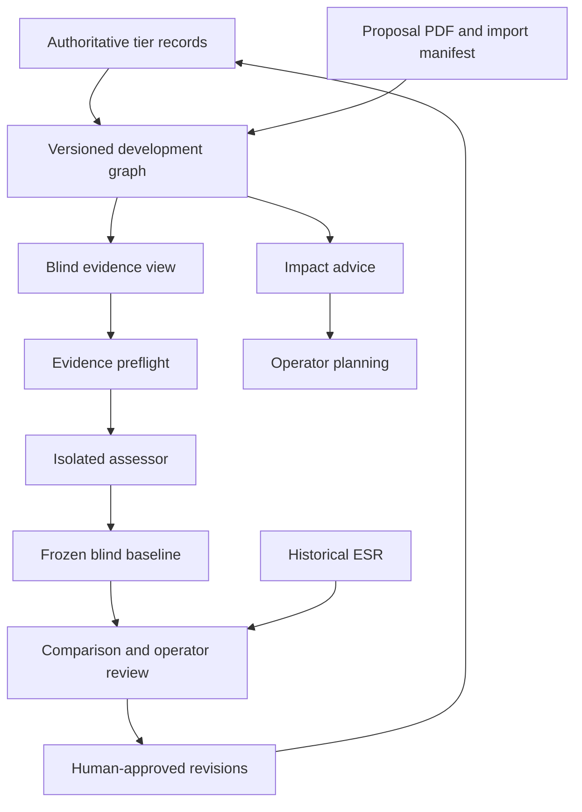

# MSCA-DN harness, development graph and pre-evaluation readiness audit

**Audit date:** 8 October 2026  
**Repository:** JozsefKiss90/proposal_orchestrator  
**Branch examined:** `msca-dn-pre-eval`  
**Pinned revision:** `ca0a443e5cdd2cee22d12fa2f4adb462cbf4a299`  
**Purpose:** determine what is complete, what is demonstrably working, and what must be closed before assessing the official 2025 submission and beginning the 2026 resubmission workflow.  
**Status:** independent repository audit and proposed acceptance gates; this document does not record a new operator approval.

## 1. Executive decision

**The PE-08 review and PE-09 preparation deliverables are substantially complete and traceable. The branch is not yet ready to import, assess and freeze the official 2025 proposal as a validated historical baseline.** It contains a functioning advisory assessment pipeline and useful development-graph infrastructure, but preparation is being mistaken for operational readiness if the checked tickets are treated as authorization to start scoring immediately.

Two material problems were reproduced during this audit: the importer does not reproduce its committed document snapshot in the fresh audit environment, and the baseline-freeze implementation accepts incomplete or internally inconsistent reports. In addition, the historical 2025 profile and original-document import configuration are explicitly unimplemented. These are bounded prerequisites; they do not justify replacing the architecture.

| Decision | Audit recommendation | Reason |
|---|---|---|
| Accept the existing PE-08 review package as the recorded sanitised-copy review | **Accept with its recorded deferrals** | All 26 path/hash bindings in the approval decision record matched the checkout; comparison replay succeeded. Acceptance does not resolve original-dependent questions. |
| Begin bounded private-environment preparation | **Conditional GO** | Establish the environment, authoritative inputs and implementation tickets described below. Preparation can proceed without claiming that assessment is ready. |
| Run and freeze the official 2025 historical assessment immediately | **NO-GO at this revision** | Import reproducibility, original-specific configuration, historical profile authority and freeze validation remain blockers. |
| Treat 74.60 as a validated predictor of the official proposal or resubmission | **NO** | It assesses a sanitised derivative using the stored 2026 profile. It is neither a replication of the official evaluation nor a calibrated forecast. |
| Claim source-grounded evaluation of the imported original | **NO-GO until the imported-claim route is implemented** | `--no-claims` deliberately makes grounding unassessable; restoring source PDFs alone does not activate the missing integration. |
| Begin substantive 2026 proposal work under the user's final-milestone condition | **HOLD until historical-validation acceptance** | The official original has not been evaluated here. Section 12 defines a finite acceptance milestone rather than an open-ended development programme. |
| Redesign the harness or graph before the historical experiment | **Not warranted by this audit** | Preserve the tier boundaries and advisory design; correct the demonstrated defects and supply the missing configuration first. |

There is also one precise correction to the premise that every acceptance criterion is checked: the R04 criterion “Draft declarations survive the supported generation workflow after adoption” remains unchecked. Its precondition—active adoption—is deliberately deferred under D13. This is an honest, bounded deferral, not evidence that all R04 preparation failed. [S01–S03]

## 2. Scope, evidence and limits

The audit inspected the approval, decision log, ticket ledger, runbook, relevant harness and development-graph implementation, importer and workspace authoring tools, profile/rubric/scoring configuration, committed candidate and baseline artifacts, comparison/revision outputs, and relevant tests. The checkout was pinned to the same commit obtained through GitHub. Its tracked tree contained 1,660 files.

Evidence is distinguished throughout:

- **Observed:** independently executed or byte-verified in this audit.
- **Implemented:** established from source inspection, with relevant tests where stated.
- **Recorded:** asserted by a committed historical report or decision record; not reproduced as a live model run here.
- **Required:** proposed acceptance work, not an existing result.

The observed verification used Python 3.12.14, PyMuPDF 1.26.6 with MuPDF 1.26.11, pytest 9.1.1 and an isolated dependency directory. The repository's runbook instead uses `py -3.10`, and historical records include Windows execution paths. This difference is material to reproducibility. The declared requirement `pymupdf>=1.24.0` admits the version used here; the checkout does not supply an exact replay environment for these extraction artifacts.

No official private proposal, private deployment, real provider session, new assessor response, new scientific judgement or new official-rule interpretation was produced. No tracked repository content was changed. Offline artifacts and deliberately modified freeze-test copies were written outside the checkout. This was a comprehensive readiness audit of the available branch, not an exhaustive security assessment or execution of every repository test.

The audit did not independently obtain or authenticate the 2025 call documents. Their absence from the available historical-profile package is itself a readiness finding; statements about scoring rules below describe the repository configuration, not a fresh certification of official eligibility or evaluation rules.

## 3. What the completed review actually establishes

The approval has durable consequences, rather than merely marking a checklist:

| Area | State at the pinned revision | Boundary |
|---|---|---|
| R01: preserve declarations during regeneration | Declaration input and retention workflow implemented | Fresh import/workspace reproduction currently fails in this environment; see F01. |
| R02: full operator-review table | Review and rendering machinery implemented | An operator-reviewed table can still contain pending decisions. |
| R03: semantic false positives and ESR matching | Validation cases and qualified interpretations recorded | AVC-01/AVC-02 still require checking against the original's future blind output. |
| R04: revision-specific declarations | Draft payloads and adoption checklist prepared | Active adoption and its downstream rebinding are deferred; one acceptance box remains open. |
| R05: successor dispositions/comparison/revisions | Approved successor artifacts generated and hash-bound | Preservation and adequacy questions requiring the original remain qualified. |
| R06: private-network runbook | Preparation document present at HEAD | It labels PE-09 as unexecuted and lists future implementation. Some operational claims need correction. |

The successor dispositions contain **9 `operator_confirmed`, 10 `operator_decision_required`, and 10 `agent_recommended_pending_operator_review` rows**. “Operator reviewed” therefore does not mean all 29 observations have been substantively approved. Q01/Q03 contain qualified or deferred interpretation, and the ten rows requiring an operator decision are not closed by a ticket checkbox.

The approval strengthened V01: a Confirmed preservation claim must reference the relevant subsection and a `fidelity_to_submitted_original` declaration with the correct scope, status, basis and evidence. V02 removes bare-numeric positional ambiguity for keyed lists while preserving declared legacy pointer rules. These are valuable validation improvements. V01 validates the structured declaration and references; it does not independently determine whether the operator's evidence is scientifically true or semantically proves preservation.

D11 retired 16 undeclared dependency findings as optional drafting context. The recorded audit sequence **40 → 29 → 13 findings** reflects changes in interpretation and audit rules as well as successive artifacts. It must not be presented as 27 proposal defects repaired. All **15 ESR criticisms** still have open revision work. [S01–S06]

## 4. Architecture and separation of responsibilities

The current design has useful boundaries worth preserving. Tiered authoritative records and imported documents supply evidence; the development graph produces versioned views/packages; the harness consumes those packages and emits advisory reports. It does not become a scheduler gate. Historical ESR material belongs in the post-freeze analysis lane.



The diagram describes intended information flow; the audit found a validation gap at the freeze boundary, not a finding that the committed baseline contains ESR leakage.

Three different “graphs” must not be conflated:

1. The authoring/Obsidian graph and its compiler/projector represent authoring structure.
2. The scheduler's manifest/dependency graph drives runtime work and reuse decisions.
3. `runner/dev_graph` builds typed, content-addressed snapshots and policy-constrained evidence views, revision and impact advice.

The development graph's shadow comparison is advisory. It does not demonstrate that every runtime reuse decision is now graph-derived, or that changes in all authoritative inputs are tracked at fine granularity. The harness-to-runner dependency direction and separation of advisory evaluation from runtime blocking are tested. This separation should remain intact while the historical validation gaps are closed. [S07–S10]

## 5. Harness capability and maturity

| Capability | Current evidence | Readiness judgement |
|---|---|---|
| Typed advisory reports, provenance and binding | Implemented; boundary and binding tests pass | Sound substrate, subject to the freeze completeness defect below. |
| Profile-driven expectations, rubrics and criterion scoring | MSCA-DN profile loads; 39 DN profile tests and 34 criterion-scoring tests pass | Operational for the stored profile; no historical 2025 authority package yet. |
| E2/status-aware faithfulness | Implemented; distinguishes Confirmed, Assumed and Inferred treatment | Available machinery, not activated as external factual grounding for the imported DN proposal. |
| E3 claim-ledger completeness/materiality/status checks | Implemented with semantic and structural tests | Some real-data fixtures are stale; an extracted claim is not independent corroboration. |
| E4 regression | Comparison machinery implemented | Actual regression-baseline directory contains only a README; no usable golden set is shipped there. |
| E5 expectation coverage and grounding | Separate axes implemented; preflight exposes evidence selection | Current imported-DN blind lane intentionally withholds claims, so grounding is unassessable. |
| Criterion-level numerical assessment | Separate from binary/aspect cells; five-sample medians/spreads in current baseline | Useful advisory scoring, not human calibration or forecast accuracy. |
| Calibration/gold-set machinery | Calibration tests pass; gold-set directory contains only a README | Infrastructure exists; expert-labelled DN validation data does not. |
| Resume/checkpoint/recovery | Raw-response checkpoint and bound replay implemented; 36 response-cache tests pass | Use it to avoid unnecessary repeat spending. Preserve malformed-response and salvage provenance. |
| E6–E10 and wider behavioural/adversarial/retrieval evaluation | Deferred in the harness plan | Broader capability backlog, not all prerequisites for one bounded historical case study. |

The stored DN scoring configuration uses three 0–5 criterion scores and `10E + 6I + 4Q`, with per-criterion threshold 3 and overall threshold 70. These totals are not computed from the ten expectation-cell verdicts. Five draws from one assessor measure within-assessor variation; they are not five independent expert reviewers.

The harness documentation and planning records mix earlier milestones with present capabilities. For example, older narrative describes E5 as future work while the code and artifacts implement it. Historical E3 adjudication results under a different judge are not evidence that the current DN scorer is calibrated. A release-status table should identify the current code, usable datasets, live-model evidence and known failing fixtures separately. [S07, S11–S14]

### Evidence selection is observable, but “complete” needs careful interpretation

The independent preflight replay succeeded using the committed resolved-fixes document and explicitly named manifest:

| Observation | Result |
|---|---:|
| Expectation packs | 10 |
| Rubrics with required anchors present | 10/10 |
| Packs reported complete | 10/10 |
| Over-budget exclusions | 0 |
| Complete criterion inputs | 3/3 |
| Criterion input tokens: Excellence / Impact / Implementation | 20,599 / 12,007 / 14,392 |
| Table rows rendered / parsed | 88 / 88 |
| Parsed cells | 610 |
| Package items included | 111 |
| Policy-forbidden exclusions | 1 |
| Package unresolved count | 136 |
| Leakage/word-scan result | Passed; no flags |

The preflight's `not_relevant` exclusions aggregate to 2,733 items and 64,430 tokens across packs; these are repeated pack-selection counts, not unique missing document material. Required anchors and no budget truncation do not prove that a keyword-based expectation pack contains every substantively relevant sentence. The criterion scorer has a different route: a whole criterion section plus its declared appendix material. The 136 unresolved package entries are metadata/provenance limitations, not 136 demonstrated proposal errors.

The preflight recreated candidate hash `sha256:242f1afb02c8…`, snapshot `sha256:a5176eef3a01…` and pack-set hash `sha256:25d8aae9b31c…`. This proves that **committed evidence artifacts can still be consumed**. It does not cure the separate failure to regenerate them from the PDF. [S15–S16]

## 6. Development-graph status

The schema defines 17 node types and 10 relationship types. Six policy views separate engineering, controlled revision, integrity audit, blind pre-evaluation, historical-feedback analysis and change-impact planning. Blind-view restrictions exclude assessment/findings/change-request material and superseded versions before package expansion, with an additional harness leakage check.

The current MSCA-DN workspace is much narrower than the schema's potential:

| Observed node type | Count |
|---|---:|
| Artifact versions | 2 |
| Claims | 90 |
| Passages | 6 |
| Sources | 168 |
| Source spans | 88 |
| **Total nodes** | **354** |

| Observed relationship | Count |
|---|---:|
| `expressed_in` | 96 |
| `supported_by` | 176 |
| `supersedes` | 1 |
| **Total edges** | **273** |

Snapshot: `sha256:a5176eef3a01f998367b3eaf356b6f84953beb6da8408ad737460b12533ed24c`.

This workspace contains two imported 84-page document versions, three criterion-section passages and 45 extracted claims per version. It has **no participant, objective, work-package, task, deliverable or milestone nodes, and no `addresses` edges**. Work-plan rows can still be parsed by the audit from section content, but those parsed rows are not thereby a populated project-engineering graph.

Consequently:

- The graph is ready to serve as a versioned document/evidence store for the bounded historical assessment once import prerequisites are fixed.
- It is not yet evidence that the DN proposal's complete research plan can be revised, traced and invalidated automatically through graph relationships.
- Before promising graph-assisted 2026 drafting, the relevant authoritative Tier 3 entities, provenance and passage-to-entity links must be populated and tested for the selected workflow.

Controlled revisions operate over a closed set of indexed Tier 3 records, with archives and rollback validation. That scope does not cover every call/Tier 2B input, arbitrary nested changes, or general multi-record transactions. Fine-grained impact/reuse should remain conservative until its authoritative input coverage is demonstrated. The older development-graph demo recorded refused real shadow comparisons and synthetic probes; it is not a production validation certificate for all reuse optimisation.

**Observed:** all **338 tests across the nine `tests/runner/test_dev_graph*.py` modules passed**. A separate harness T03 end-to-end test failed because its scripted assessor lacks the criterion scorer's required `shortcomings` list. The command refused the malformed response and checkpointed it. That is a stale test-backend contract, rather than evidence that a graph revision mutated scheduler state. [S08–S10, S17]

## 7. Import and source fidelity

### F01 — High: PDF-to-artifact replay is not reproducible in the fresh environment

**Observed:** `python -m tools.import_external_proposal --check` exited 1. It derived document ID `MSCA-DN-2025_sanitised_part_b@842a80dea6920270` and refused because that snapshot was not in the current build. The committed first-version ID ends in `@bdb8670f6987e4db`; the resolved-fixes version ends in `@b51a103520b58ded`.

`python -m tools.author_msca_dn_workspace --check` also exited 1, reporting a fidelity register change. Read-only recomputation found, for example:

| Register measure | Committed | Recomputed |
|---|---:|---:|
| Subsection 1.1 paragraphs | 302 | 307 |
| Subsection 1.1 characters | 19,601 | 19,606 |
| Subsection 1.3 paragraphs | 66 | 69 |
| Subsection 1.3 characters | 10,010 | 10,013 |

The exact cause was not isolated. Extraction-library/runtime variation is a plausible explanation, not a proved root cause. The import records name the project's own extractor/normalisation versions but do not fully pin Python, PyMuPDF and MuPDF. A broad dependency lower bound is inadequate for byte-identical provenance replay.

**Required closure:** recover the previously validated environment, reproduce both sanitised versions there, identify the cause of the divergence, and record an exact supported extraction environment. If an intentional extraction upgrade is necessary, treat it as a new version with explained differences and successor bindings. Do not simply regenerate every hash to make the check pass.

### F02 — High: the official original needs more than a new Revision row

The importer has useful generic extraction machinery, but its current application wrapper is configured for two sanitised revisions. It also fixes the workspace location, sanitised title, 84-page assumptions, subsection page ranges, criterion heading/page anchors, beneficiary marker and submitted-document metadata. The manifest renders `is_submitted_document: false`.

The original must independently establish its identity, role, page count, section boundaries, table interpretation, source identifiers and figure coverage. It must not inherit a sanitised page map or be described as a derivative. It must not be made a descendant of the sanitised version merely to reuse the version chain.

**Required closure:** a selectable document/workspace configuration that externalises all these assumptions; separate intake and original-document provenance; and a dry import whose section/table/figure inventory is manually reconciled to the PDF. Both existing sanitised configurations must still reproduce under the chosen environment.

### Extraction accounting is not semantic fidelity

The extraction route uses PyMuPDF text/blocks and table detection with `lines_strict`. Normalised character counts and row accounting are valuable checks, but do not prove reading order, cell association, mathematical meaning, image content or completeness of figures. Character deficits and surpluses can offset in an aggregate. Page/source spans locate an assertion; they do not corroborate it.

The original's Gantt, diagrams, embedded images, footnotes, table headers, bibliographic references and any supporting Part B material therefore need explicit acceptance. Neither “zero character loss” nor “zero embedded images” establishes that all graphical evidence was preserved. [S18–S20]

## 8. Assessment, isolation and freeze controls

### F03 — High: freeze accepts incomplete and inconsistent reports

The complete `freeze_baseline` path was exercised on copies of the committed report, using the real candidate, loaded profile bundle, matching profile version and readable preflight. Each case wrote only to an isolated audit directory.

| Probe | Actual result | Required behaviour |
|---|---|---|
| Unmodified control: 10 cells, 3 criteria, total 74.6 | Accepted; 15 checks passed | Accept |
| Keep only 1 of 10 cells | Accepted; 15 checks passed | Refuse missing expected cells |
| Keep only 1 of 3 criterion scores | Accepted; 15 checks passed | Refuse incomplete criterion set |
| Remove `assessor_invocation` | Accepted; 15 checks passed | Require applicable invocation/isolation evidence |
| Replace total 74.6 with 99.9 | Accepted; 15 checks passed | Refuse aggregate inconsistency |

The code verifies nonempty lists and selected fields, bindings on entries that remain, a declared sample count and a non-null total. It does not enforce the profile's exact cell/criterion identity sets or recompute the total from criterion scores. Removing records therefore leaves nothing for its per-entry binding loop to reject.

This is an acceptance-validation defect, not evidence that the existing baseline was altered. The original has ten cells, three criterion scores and the consistent total 74.6; its approval hashes all match.

**Required closure:** enforce exact expected identities and cardinalities; reject duplicates; verify member counts, score ranges, medians, spreads and aggregate arithmetic; require transport-appropriate invocation evidence; and reject these reproduced negative cases. Preserve immutable copies and one-freeze-per-directory behaviour. Add focused negative tests for these conditions rather than repeatedly rerunning the entire repository.

### F04 — Medium: runbook overstates the freeze and live isolation evidence

The runbook says the fifteen freeze checks include the planted-marker test. They do not. Planted-marker protection is exercised by transport/isolation tests; it is not a runtime step inside `freeze_baseline`.

The subscription assessor implements a fresh working directory outside the repository, an empty tool list and strict MCP configuration. Relevant tests establish the rendered invocation and failure behaviour. These are meaningful controls. An external working directory is not an operating-system sandbox, and tool disabling is not approval to send private proposal content to a provider.

The private operator must verify the actual CLI/version/configuration and record the environment's permitted processing route before a private run. Use a separate isolation verification receipt and the run's actual invocation evidence. Do not describe it as a check that freeze currently executes.

Model/version strings are declared identifiers rather than immutable runtime attestation. The judge's drafter-model exclusion is based on configured strings; aliases do not prove independence. The subscription route already acknowledges weaker vendor/transport independence. Record the actual model identity and effective settings when available: a configured temperature of zero or token limit should not be claimed as transmitted if the CLI transport does not enforce it.

Checkpointing defaults to an automatic checkpoint directory, so the runbook's example need not name `--checkpoint` to enable it. The private handoff should nevertheless record the exact checkpoint path and preserve malformed responses and any salvage decision. Recovery is not permission to silently replace an inconvenient valid sample. [S21–S24]

## 9. Historical profile, grounding and audit portability

### F05 — High: no authoritative historical 2025 profile is supplied

The only DN profile at this revision is `msca_dn_2026_default.json`. Form-equivalence records do not establish equivalence of every historical call/work-programme rule. The runbook proposes copying the 2026 profile and leaving a rule unchanged where no source states a difference. That is a defaulting policy, not affirmative evidence that the rule applied in 2025.

**Required closure:** construct a distinct historical profile with a source matrix for criteria, weights, thresholds, instructions, variant, section/appendix mapping and relevant scoring assumptions. Every retained rule needs sourced equivalence or an explicit unresolved limitation. A rule affecting interpretation or numerical scoring cannot silently become “2025” because evidence of a difference was not found. Pin the source documents and profile/rubric versions, then run focused profile and example-scoring tests.

The 2026/resubmission profile needs its own applicability confirmation at Stage B. Do not reuse a historical freeze, candidate, preflight or scoring result for a different candidate/profile pair. [S03, S11–S12]

### F06 — High for truthful original reporting: sanitisation assumptions are hard-coded

`harness/integrity_audit.py` sets the grounding reason to **“supporting sources removed by sanitisation”** and expects imported ledger claims to remain `unresolved`. It also contains sanitisation-specific explanations for host-identity limitations. Applying this unchanged to the original would misstate the cause of missing corroboration even if that original contains references and identities.

**Required closure before Stage A audit:** derive these statements from the imported candidate's actual provenance and capabilities. The original may still lack independently verified support, but the reason must be accurate. Revalidate table schemas and identity comparisons against the original; anonymised host assumptions cannot be treated as an original-document rule.

### F07 — Conditional blocker: grounding remains an unimplemented imported-document capability

The sanitised ledger contains 45 unresolved claims per revision. The blind lane uses `--no-claims`, making every cell's grounding unassessable. The runbook correctly identifies three missing integrations: imported-section claim loading with resolvable sources, supported statuses backed by evidence, and E2 grounding over that ledger.

There are two legitimate scope choices:

| Intended result | Minimum requirement |
|---|---|
| Blind assessment of proposal content/credibility and historical comparison | May proceed after other gates, with grounding prominently reported **unassessable** and a human source/fidelity review. |
| Claim that the original or new proposal has been source-grounded or factually verified | Implement and validate all three imported-claim components first, then review the actual supporting sources. |

Proposal-internal coherence, scientific plausibility, fidelity to the submitted text and independent factual support are different claims. A source span inside the proposal can establish what was submitted; it does not independently prove a partner commitment, access entitlement or scientific result. [S03, S13, S25]

## 10. What the current results mean

The approved comparison replayed successfully from the committed baseline and approved dispositions. It contains **29 observations: 8 shortcomings, 7 minor shortcomings and 14 strengths**.

| Classification | All observations |
|---|---:|
| Independently detected | 14 |
| Partially observable | 7 |
| Not detected despite declared sufficient preserved evidence | 7 |
| Not assessable from this copy | 1 |
| Addressed | 0 |

For criticisms only, the report counts **5 fully detected and 2 partial out of 14 rated**, with one unassessable criticism excluded from the denominator: full detection 0.36; full-or-partial detection 0.50. These rates are conditional on the current preservation/disposition declarations. They are not precision/recall estimates against an independently labelled full corpus. There are also **8 contested strengths**.

| Criterion | Historical ESR score | Sanitised-copy blind median | Within-assessor spread | Difference |
|---|---:|---:|---:|---:|
| Excellence | 4.2 | 4.0 | 0.3 | −0.2 |
| Impact | 4.5 | 3.3 | 0.4 | −1.2 |
| Implementation | 4.2 | 3.7 | 0.2 | −0.5 |
| Weighted total | 85.8 | 74.6 | Not an accuracy interval | −11.2 |

**Do not infer that the harness under-scores the official original by 11.2 points.** Candidate content and historical-profile applicability differ. The Stage A experiment must establish what changes when the actual original is assessed under a justified historical profile. A single proposal still cannot establish population-level predictive accuracy, and matching 85.8 is not itself proof of a good evaluator.

The comparison's single unresolved-disposition marker (`ESR-E-04`) is not a count of every remaining uncertainty. Other rows retain Inferred interpretations, pending operator decisions or original-dependent evidence questions.

The latest integrity audit has 13 findings and inventories 88 parsed rows, including 28 deliverable, 16 milestone, 9 doctoral-candidate and 10 risk rows, plus seven work-package header blocks and merged-row handling. This is consistency checking, not a declaration that 13 scientific defects have been independently confirmed. M7.3, appointment windows and Q03 remain subject to the operator's deferred interpretation. No timing or participation change should be made merely to satisfy the heuristic. [S04–S06, S25–S26]

## 11. Independent verification results and release confidence

The focused audit command was:

```bash
PYTHONPATH=<isolated-audit-dependencies> python -m pytest \
  tests/harness tests/runner/test_dev_graph*.py tests/test_msca_dn*.py \
  -q -o addopts='' --tb=short --junitxml=<audit-output>/focused.xml
```

It completed in **107.82 seconds** with **1,864 passed, 44 failed, 48 errors and 8 skipped**: 1,964 collected cases. Setup errors are not additional proven product defects; many share a failed import fixture. The suite is nevertheless not green.

| Test group | Passed | Failed | Errors | Skipped |
|---|---:|---:|---:|---:|
| Harness | 1,284 | 15 | 5 | 8 |
| Development-graph runner modules | 338 | 0 | 0 | 0 |
| MSCA-DN integration modules | 242 | 29 | 43 | 0 |
| **Total** | **1,864** | **44** | **48** | **8** |

Principal failure families:

| Family | Observed interpretation | Required handling |
|---|---|---|
| MSCA-DN import/workspace/fidelity/adoption fixtures | Replay drift propagates into many failures/setup errors | Resolve F01 first; then rerun these targeted modules before classifying residual defects. |
| Claim-ledger real-data checks | Expected counts/fixtures differ from current data | Reconcile the authoritative fixture; do not force code to reproduce stale counts blindly. |
| Evidence-pack real-data checks | Section/profile fixture mismatch | Make the intended profile/data pairing explicit. |
| Ledger-granularity and regression golden checks | Missing gold artifacts | Restore a maintained dataset or explicitly scope these tests out with a documented reason and replacement evidence. |
| Rubric-report fixture | Missing current `confirmation_checklist` shape | Update the fixture/contract consistently. |
| T03 harness integration | Scripted backend has no criterion `shortcomings` list | Update the synthetic response contract; retain fail-closed behaviour. |
| Subscription-judge cwd refusal | Fresh checkout lacks the expected `.claude/runs` fixture, so refusal happens earlier | Construct the fixture and test the intended path rule portably. |
| Integrity audit integration | Two failures depend on regenerated document identity | Reassess after import reproduction is restored. |

Passing areas include approval transcription (37 tests), ESR comparison (94), operator review (81), comparison diff (23), blind assessment (33), baseline tests (33), leakage (22), preflight (40), criterion scoring (34) and response caching (36). Passing baseline tests did **not** cover the defects reproduced by the new freeze probes; test counts are not a substitute for coverage of acceptance invariants.

Other observed checks:

| Check | Result |
|---|---|
| Approval-record path/hash bindings | **26/26 match** |
| `tools.author_approved_dispositions --check` | Passed; up to date |
| `tools.draft_fidelity_declarations --check` | Passed; up to date |
| `tools.import_external_proposal --check` | Failed; document identity drift |
| `tools.author_msca_dn_workspace --check` | Failed; register would change |
| Offline preflight on committed resolved-fixes import | Passed; no flags |
| Approved ESR comparison replay | Passed; reproduced counts and scores |
| Freeze control and four negative probes | Control accepted; all four invalid variants also accepted |
| Tracked checkout after audit | Clean |

The approval record describes earlier failing-ID comparisons against the R05 parent. Those are historical evidence. This audit did not rerun the parent in the same environment and therefore does not claim which current failures were introduced by the final commit. It also did not run the entire runner/top-level suite. No hosted `.github` CI configuration was present to provide a separate current CI result.

**F08 — High for release confidence:** establish a named, supported PE-09 acceptance lane with reproducible dependencies and zero unexplained failures. Unrelated legacy suites may have explicit scoped exceptions, but importer, profile, preflight, freeze, comparison, provenance and isolation checks used by the historical run must pass. Missing gold data must remain visible; it cannot be converted into a claim of successful calibration. [S02, S27]

## 12. Finite closure plan and operator gates

This plan completes the historical milestone before 2026 work without requiring every future harness feature. Owners below are roles to assign, not claims that a named person has accepted work.

| Gate | Work and accountable role | Evidence required for closure | Blocks |
|---|---|---|---|
| G1 — Reproducible import | Runtime/import maintainer: resolve F01 and pin the supported environment | Both sanitised versions reproduce; two `--check` commands pass; runtime/extraction versions recorded; residual test failures explained | Any original import treated as reproducible |
| G2 — Original-specific intake | Import maintainer + private operator: implement F02 | Distinct original configuration; authenticated input hash; correct submitted identity; measured section/table/figure inventory; faithful extraction review; no inherited sanitised assumptions | Stage A preflight |
| G3 — Historical authority | Proposal/call owner + profile maintainer: resolve F05 | Pinned 2025 authority documents, rule/equivalence matrix, separate historical profile, profile/scoring tests | Stage A numerical assessment |
| G4 — Freeze and report truth | Harness maintainer: resolve F03/F04/F06 | Negative freeze probes rejected; original-sensitive audit wording; corrected runbook; passing focused tests | Stage A baseline acceptance and audit |
| G5 — Private execution readiness | Private-environment operator | Permitted processing/export route; actual CLI/model/invocation evidence; isolation check; checkpoint location; complete preflight with named manifest | Sending original evidence to an assessor |
| G6 — Historical experiment | Operator/evaluator, after G1–G5 | One fresh original assessment under the historical profile; frozen baseline before ESR analysis; row-level comparison and score deltas; AVC-01/02 review; original-dependent decisions resolved or explicitly limited | Final historical milestone |
| G7 — Milestone acceptance | Proposal owner/operator | Signed acceptance of G6's evidence and residual limitations; prioritised revision plan; selected grounding scope; a defined Stage B profile and candidate/version process | Substantive 2026 proposal workflow under this milestone |

Dependencies are G1 → G2; G3 and G4 can proceed independently; G2/G3/G4/G5 must all be satisfied before G6. G7 follows G6. There is no reason to spend model quota while G1–G5 remain open.

### Stage A protocol: official 2025 proposal

1. Pin the input PDF, governing source documents, runtime and code revision privately. Keep proposal evidence separate from ESR/review material.
2. Import as a distinct original document. Review fidelity to the actual submitted material, including figures and the declared appendix mapping. Record unresolved extraction limitations before assessment.
3. Load the sourced historical profile. Preflight with the actual transport, explicit manifest and intended grounding scope. Review both expectation-pack selections and whole-criterion inputs.
4. Run one blind assessment with the declared sample plan and response checkpointing. Resume matching saved responses rather than redrawing a failed run unnecessarily.
5. Validate and freeze the complete report using the corrected gate. Record actual invocation/isolation evidence and profile/candidate bindings.
6. Only then introduce the ESR into comparison. Author schema-appropriate original dispositions and fidelity declarations, run the integrity audit with correct provenance, and review all criticism/strength classifications.
7. Evaluate missed findings, false positives, contested strengths and criterion deltas. Investigate AVC-01/AVC-02 at sample level. Record a diagnosis—evidence omission, extraction, rubric interpretation, assessor error, historical subjectivity or unresolved cause—rather than merely pursuing a target score.
8. Approve a finite revision backlog with source and human confirmation requirements. Do not infer numerical deductions for individual criticisms where the ESR does not supply them.

A content-focused Stage A can be accepted with grounding unassessable if the operator explicitly accepts that scope. A source-grounded Stage A cannot. The acceptance must state which was performed.

### Stage B protocol: the new resubmission

After G7, implement human-approved scientific and programme changes in authoritative inputs and the proposal. Numerical targets, access claims, partner commitments, study design and timing need the relevant human confirmation. Keep the two beyond-ESR improvements labelled as such.

Import the revised proposal as a new candidate under the applicable resubmission profile. Give it a new manifest, register/declarations, preflight, assessment, audit and report bindings. The ESR can inform the human revision plan, but must not enter the Stage B blind assessor's evidence. There is no future ESR to compare at this stage. The runbook’s blanket reuse of Sections 4–6 should explicitly exclude the ESR comparison, its review and its diff, rather than carrying those commands into Stage B. Scores remain advisory; do not treat an arbitrary target or a narrow repeatability spread as a funding forecast.

### What is deliberately outside the minimum Stage A milestone

Full multi-record graph editing, complete project-entity population, fine-grained scheduler reuse, cross-baseline diff automation, a broad multi-proposal calibration corpus, and every E6–E10 experiment are not all prerequisites for this one historical validation. Schedule them when the corresponding claim or workflow is needed. Full imported-source grounding is a prerequisite only if that capability is claimed.

The existing same-baseline `diff` correctly refuses comparisons across different frozen baselines. The runbook includes such a guaranteed-refusal command. Remove it from the operational success path; use an explicitly labelled row-by-observation comparison for the two readings. A cross-baseline tool is optional convenience, not a reason to bypass binding checks or delay the historical experiment indefinitely.

## 13. Consolidated findings and disposition

| ID | Severity / scope | Finding | Disposition before the next stage |
|---|---|---|---|
| F01 | High; import reliability | Fresh extraction does not reproduce committed artifacts | Mandatory G1 |
| F02 | High; original applicability | Import wrapper embeds sanitised-document assumptions | Mandatory G2 |
| F03 | High; baseline integrity | Freeze accepts missing cells/criteria/invocation and wrong total | Mandatory G4 |
| F04 | Medium; operational assurance | Runbook confuses test-time marker checking with runtime freeze; private invocation unverified | Mandatory correction and G5 evidence |
| F05 | High; historical validity | No sourced historical 2025 profile | Mandatory G3 |
| F06 | High for truthful reporting | Audit attributes original grounding/identity limits to sanitisation | Mandatory before original audit |
| F07 | Conditional capability blocker | Imported-source grounding route absent | Implement before claiming grounded evaluation; otherwise explicit limitation |
| F08 | High; release confidence | Relevant acceptance suite not reproducible/green | Mandatory scoped PE-09 acceptance lane |
| F09 | Medium; later automation | DN graph lacks project entities and `addresses` links | Required before claiming trace-driven engineering/drafting automation |
| F10 | Medium; evaluator claims | Human DN calibration/golden datasets absent | Required before broader accuracy or robust comparative-performance claims |
| F11 | Governance clarification | One R04 box, ten operator decisions and other qualified interpretations remain | Preserve deferrals; resolve with original where required, never auto-check |
| F12 | Medium; runbook execution | Historical defaulting, original import instructions and cross-baseline diff need correction | Revise operational runbook as part of G2–G4 |

Severity reflects whether a finding undermines the next proposed result. It is not a claim of a security vulnerability or a demand for a general platform rewrite.

## 14. Proposed operator acceptance record

This section is intentionally **unsigned and pending**. It can be used by the operator and Claude to track the next gates, but it does not grant authority to mark them complete.

| Acceptance item | Current audit state | Closure reference to be supplied |
|---|---|---|
| Current sanitised review package accounted for | Verified: 26/26 hash bindings; recorded deferrals retained | This audit + existing approval decision |
| G1 reproducible import | Open | Runtime pin, replay results, targeted tests |
| G2 original intake/configuration | Open | Private input/import/fidelity records |
| G3 historical profile authority | Open | Authority matrix and profile version |
| G4 corrected acceptance/reporting controls | Open | Code revision and negative-test evidence |
| G5 private execution readiness | Not observed | Private operator receipt |
| G6 original historical validation | Not executed | Frozen original baseline and post-freeze review |
| G7 authorization to begin 2026 work | Pending operator decision | Signed decision referencing G1–G6 |
| R04 active declaration adoption | Deferred by existing D13 | Successor provenance only if adoption is chosen |

Suggested decision text, for the operator to complete after reviewing the evidence:

> I accept the historical-validation result identified by candidate hash ______, profile version ______, code revision ______ and frozen report hash ______. I have reviewed the remaining uncertainties and approve the following scope for 2026 work: ______. Imported-source grounding is [validated / explicitly unassessable]. Deferred matters and their owners are ______. Approval identity/date/reference: ______.

Claude should mark a gate checked only when its closure evidence and the required operator decision exist. A report being generated, a command being listed, an inherited approval, or an empty placeholder is not closure evidence. The existing sanitised baseline and approval records should remain unchanged; new decisions belong in successor records.

## Appendix A. Reproduction and evidence ledger

The audit retained the focused JUnit result, full test log, module/failure summary, import/workspace check logs, measured register differences, approval-hash verification, graph inventory, replayed preflight/comparison and isolated freeze-probe outputs in the audit workspace. The relevant substantive results are embedded in this report so it stands on its own.

The following operations required no assessor calls:

```bash
python -m tools.import_external_proposal --check
python -m tools.author_msca_dn_workspace --check
python -m tools.author_approved_dispositions --check
python -m tools.draft_fidelity_declarations --check

python -m harness.commands.blind_assessment preflight \
  --document MSCA-DN-2025_sanitised_part_b@b51a103520b58ded \
  --graph-root workspaces/msca_dn \
  --profile harness/profiles/msca_dn_2026_default.json \
  --transport claude-cli --no-claims \
  --import-manifest workspaces/msca_dn/docs/tier4_orchestration_state/dev_graph/imports/MSCA-DN-2025_sanitised_part_b.resolved_fixes.json \
  --out-dir <isolated-audit-output>/preflight_replay
```

The comparison replay used the committed `resolved_fixes_2026-10-06` baseline, `msca-dn-2025-esr.json`, `dispositions_f60ae6e0a2a1_approved.json`, both committed materialised candidates, `fidelity_register_resolved_fixes.json`, audits `integrity_242f1afb02c8_0003.json` and `integrity_13ad3ad81d7e_0001.json`, and the stored DN 2026 profile. It wrote to an isolated output directory.

Freeze probes called `freeze_baseline` with the real candidate, `load_profile_bundle(...).profile`, the bundle's version and repository root. Each variant altered only the field stated in Section 8. This exercised candidate rebinding and the actual write path, not merely a helper predicate. The control and invalid variants were separate copies; none replaced the real baseline.

For a future release rerun, use the supported pinned environment established by G1. Keep comparison/preflight output isolated, and preserve the original reports. No new model run is necessary to confirm a deterministic importer, profile loader, freeze validator or report-binding fix.

## Appendix B. Pinned source index

All links below resolve to the audited commit rather than the moving branch. Group references in the report identify the primary code or records supporting the associated conclusions.

| Ref | Source |
|---|---|
| S01 | [PE-08 review / PE-09 handoff tickets](https://github.com/JozsefKiss90/proposal_orchestrator/blob/ca0a443e5cdd2cee22d12fa2f4adb462cbf4a299/plans/pe08_review_and_pe09_handoff_tickets.md) |
| S02 | [Operator approval decision record](https://github.com/JozsefKiss90/proposal_orchestrator/blob/ca0a443e5cdd2cee22d12fa2f4adb462cbf4a299/docs/tier4_orchestration_state/decision_log/msca-dn-operator-approval_2026-10-08.json) |
| S03 | [PE-09 private-network runbook](https://github.com/JozsefKiss90/proposal_orchestrator/blob/ca0a443e5cdd2cee22d12fa2f4adb462cbf4a299/plans/msca_dn_pe09_runbook.md) |
| S04 | [Operator approval document](https://github.com/JozsefKiss90/proposal_orchestrator/blob/ca0a443e5cdd2cee22d12fa2f4adb462cbf4a299/docs/tier4_orchestration_state/msca_dn/reviews/operator_approval_2026-10-08.md) |
| S05 | [Approved successor dispositions](https://github.com/JozsefKiss90/proposal_orchestrator/blob/ca0a443e5cdd2cee22d12fa2f4adb462cbf4a299/docs/tier4_orchestration_state/msca_dn/esr/dispositions_f60ae6e0a2a1_approved.json) |
| S06 | [Approved comparison](https://github.com/JozsefKiss90/proposal_orchestrator/blob/ca0a443e5cdd2cee22d12fa2f4adb462cbf4a299/docs/tier4_orchestration_state/msca_dn/comparisons/comparison_f60ae6e0a2a1_0003.json) and [revision plan](https://github.com/JozsefKiss90/proposal_orchestrator/blob/ca0a443e5cdd2cee22d12fa2f4adb462cbf4a299/docs/tier4_orchestration_state/msca_dn/comparisons/revisions_f60ae6e0a2a1_0003.json) |
| S07 | [Harness architecture](https://github.com/JozsefKiss90/proposal_orchestrator/blob/ca0a443e5cdd2cee22d12fa2f4adb462cbf4a299/harness/HARNESS.md) and [boundary tests](https://github.com/JozsefKiss90/proposal_orchestrator/blob/ca0a443e5cdd2cee22d12fa2f4adb462cbf4a299/tests/harness/test_boundary.py) |
| S08 | [Development-graph schema](https://github.com/JozsefKiss90/proposal_orchestrator/blob/ca0a443e5cdd2cee22d12fa2f4adb462cbf4a299/runner/dev_graph/schema.py) and [builder](https://github.com/JozsefKiss90/proposal_orchestrator/blob/ca0a443e5cdd2cee22d12fa2f4adb462cbf4a299/runner/dev_graph/builder.py) |
| S09 | [Controlled revisions](https://github.com/JozsefKiss90/proposal_orchestrator/blob/ca0a443e5cdd2cee22d12fa2f4adb462cbf4a299/runner/dev_graph/revisions.py) and [shadow advice](https://github.com/JozsefKiss90/proposal_orchestrator/blob/ca0a443e5cdd2cee22d12fa2f4adb462cbf4a299/runner/dev_graph/shadow.py) |
| S10 | [Development-graph demo report](https://github.com/JozsefKiss90/proposal_orchestrator/blob/ca0a443e5cdd2cee22d12fa2f4adb462cbf4a299/plans/reports/dev_graph_demo_report_2026-10-03.md) |
| S11 | [DN profile](https://github.com/JozsefKiss90/proposal_orchestrator/blob/ca0a443e5cdd2cee22d12fa2f4adb462cbf4a299/harness/profiles/msca_dn_2026_default.json) and [DN scorecard](https://github.com/JozsefKiss90/proposal_orchestrator/blob/ca0a443e5cdd2cee22d12fa2f4adb462cbf4a299/harness/evaluator_scorecard_msca_dn.json) |
| S12 | [DN rubrics](https://github.com/JozsefKiss90/proposal_orchestrator/blob/ca0a443e5cdd2cee22d12fa2f4adb462cbf4a299/harness/rubrics_msca_dn.json) and [profile bundle loading](https://github.com/JozsefKiss90/proposal_orchestrator/blob/ca0a443e5cdd2cee22d12fa2f4adb462cbf4a299/harness/rubrics.py) |
| S13 | [Status-aware faithfulness](https://github.com/JozsefKiss90/proposal_orchestrator/blob/ca0a443e5cdd2cee22d12fa2f4adb462cbf4a299/harness/status_faithfulness.py) and [claim ledger](https://github.com/JozsefKiss90/proposal_orchestrator/blob/ca0a443e5cdd2cee22d12fa2f4adb462cbf4a299/harness/claim_ledger.py) |
| S14 | [Harness tickets](https://github.com/JozsefKiss90/proposal_orchestrator/blob/ca0a443e5cdd2cee22d12fa2f4adb462cbf4a299/plans/harness_plan/tickets_eval_harness.md), [gold-set status](https://github.com/JozsefKiss90/proposal_orchestrator/blob/ca0a443e5cdd2cee22d12fa2f4adb462cbf4a299/harness/gold_sets/README.md) and [regression-baseline status](https://github.com/JozsefKiss90/proposal_orchestrator/blob/ca0a443e5cdd2cee22d12fa2f4adb462cbf4a299/harness/regression_baselines/README.md) |
| S15 | [Evidence preflight](https://github.com/JozsefKiss90/proposal_orchestrator/blob/ca0a443e5cdd2cee22d12fa2f4adb462cbf4a299/harness/evidence_preflight.py) and [evidence pack selection](https://github.com/JozsefKiss90/proposal_orchestrator/blob/ca0a443e5cdd2cee22d12fa2f4adb462cbf4a299/harness/evidence_pack.py) |
| S16 | [Committed preflight](https://github.com/JozsefKiss90/proposal_orchestrator/blob/ca0a443e5cdd2cee22d12fa2f4adb462cbf4a299/harness/blind_reports/preflight_242f1afb02c8_0001.json) |
| S17 | [T03 harness end-to-end test](https://github.com/JozsefKiss90/proposal_orchestrator/blob/ca0a443e5cdd2cee22d12fa2f4adb462cbf4a299/tests/harness/test_dev_graph_t03_end_to_end.py) |
| S18 | [DN import wrapper](https://github.com/JozsefKiss90/proposal_orchestrator/blob/ca0a443e5cdd2cee22d12fa2f4adb462cbf4a299/tools/import_external_proposal.py) and [workspace authoring](https://github.com/JozsefKiss90/proposal_orchestrator/blob/ca0a443e5cdd2cee22d12fa2f4adb462cbf4a299/tools/author_msca_dn_workspace.py) |
| S19 | [Generic external-proposal extraction](https://github.com/JozsefKiss90/proposal_orchestrator/blob/ca0a443e5cdd2cee22d12fa2f4adb462cbf4a299/runner/external_proposal.py) and [dependencies](https://github.com/JozsefKiss90/proposal_orchestrator/blob/ca0a443e5cdd2cee22d12fa2f4adb462cbf4a299/requirements.txt) |
| S20 | [Resolved-fixes import manifest](https://github.com/JozsefKiss90/proposal_orchestrator/blob/ca0a443e5cdd2cee22d12fa2f4adb462cbf4a299/workspaces/msca_dn/docs/tier4_orchestration_state/dev_graph/imports/MSCA-DN-2025_sanitised_part_b.resolved_fixes.json) and [fidelity register](https://github.com/JozsefKiss90/proposal_orchestrator/blob/ca0a443e5cdd2cee22d12fa2f4adb462cbf4a299/docs/tier3_project_instantiation/source_materials/msca_dn/fidelity_register_resolved_fixes.json) |
| S21 | [Freeze implementation](https://github.com/JozsefKiss90/proposal_orchestrator/blob/ca0a443e5cdd2cee22d12fa2f4adb462cbf4a299/harness/blind_baseline.py) and [report binding](https://github.com/JozsefKiss90/proposal_orchestrator/blob/ca0a443e5cdd2cee22d12fa2f4adb462cbf4a299/harness/blind_assessment.py) |
| S22 | [Subscription assessor](https://github.com/JozsefKiss90/proposal_orchestrator/blob/ca0a443e5cdd2cee22d12fa2f4adb462cbf4a299/harness/commands/_subscription_judge.py) and [Claude transport](https://github.com/JozsefKiss90/proposal_orchestrator/blob/ca0a443e5cdd2cee22d12fa2f4adb462cbf4a299/runner/claude_transport.py) |
| S23 | [Blind assessment commands/checkpoint handling](https://github.com/JozsefKiss90/proposal_orchestrator/blob/ca0a443e5cdd2cee22d12fa2f4adb462cbf4a299/harness/commands/blind_assessment.py) |
| S24 | [Frozen report](https://github.com/JozsefKiss90/proposal_orchestrator/blob/ca0a443e5cdd2cee22d12fa2f4adb462cbf4a299/docs/tier4_orchestration_state/msca_dn/baselines/resolved_fixes_2026-10-06/blind_baseline_f60ae6e0a2a1.json) and [freeze record](https://github.com/JozsefKiss90/proposal_orchestrator/blob/ca0a443e5cdd2cee22d12fa2f4adb462cbf4a299/docs/tier4_orchestration_state/msca_dn/baselines/resolved_fixes_2026-10-06/blind_baseline_f60ae6e0a2a1.freeze.json) |
| S25 | [Integrity audit implementation](https://github.com/JozsefKiss90/proposal_orchestrator/blob/ca0a443e5cdd2cee22d12fa2f4adb462cbf4a299/harness/integrity_audit.py) and [latest resolved-fixes audit](https://github.com/JozsefKiss90/proposal_orchestrator/blob/ca0a443e5cdd2cee22d12fa2f4adb462cbf4a299/docs/tier4_orchestration_state/msca_dn/audit/integrity_242f1afb02c8_0003.json) |
| S26 | [Pre-evaluation specification](https://github.com/JozsefKiss90/proposal_orchestrator/blob/ca0a443e5cdd2cee22d12fa2f4adb462cbf4a299/plans/msca_dn_pre_evaluation_spec.md) and [ESR comparison implementation](https://github.com/JozsefKiss90/proposal_orchestrator/blob/ca0a443e5cdd2cee22d12fa2f4adb462cbf4a299/harness/esr_comparison.py) |
| S27 | [Harness test directory](https://github.com/JozsefKiss90/proposal_orchestrator/tree/ca0a443e5cdd2cee22d12fa2f4adb462cbf4a299/tests/harness), [runner tests](https://github.com/JozsefKiss90/proposal_orchestrator/tree/ca0a443e5cdd2cee22d12fa2f4adb462cbf4a299/tests/runner) and [MSCA-DN import tests](https://github.com/JozsefKiss90/proposal_orchestrator/blob/ca0a443e5cdd2cee22d12fa2f4adb462cbf4a299/tests/test_msca_dn_import.py) |

**Final audit position:** the existing review milestone is a credible foundation, but it does not close the historical-validation milestone. Close G1–G5, execute the official-original experiment once under controlled conditions, and accept its evidence through G6–G7 before treating the infrastructure as ready for the 2026 resubmission workflow.
